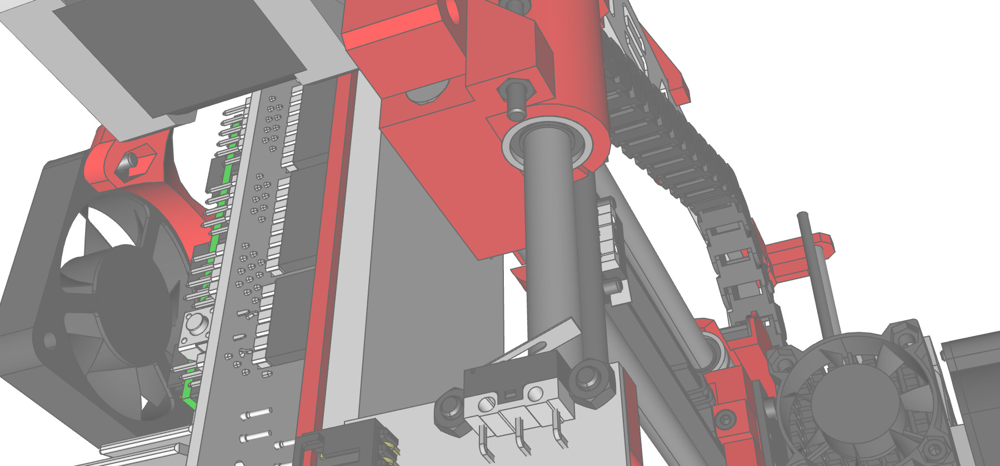

# A FreeCAD manual

**Important Note**: The manual has been moved to the [official FreeCAD wiki](https://wiki.freecadweb.org/Manual) which is now its new home. If you wish to propose edits, please do them there, as this repository will be kept only for generating the ebook versions and will not be directly edited anymore.

## Introduction

[FreeCAD](http://www.freecadweb.org) is a free, open-source parametric 3D modeling application. It is made primarily to model real-world objects, ranging from the small electronic components up to buildings and civil engineering projects, with a strong focus on 3D-printable objects. FreeCAD is free to download, use, distribute and modify, and its source code is open and published under the very permissive [LGPL](https://en.wikipedia.org/wiki/GNU_Lesser_General_Public_License) license. The data you produce with FreeCAD is fully yours, and can be recovered without FreeCAD.

FreeCAD is also fundamentally a social project, as it is developed and maintained by a community of developers and users united by their passion for FreeCAD.

This manual is an experiment at taking the opposite way from the [official FreeCAD documentation wiki](http://www.freecadweb.org/wiki). The wiki is written collaboratively by dozens of community members and, like most wikis, it contains huge amounts of information, but is very hard to access and navigate by newcomers. This makes it a precious resource for reference, but not a very practical tool to learn FreeCAD. This manual will walk you through the same information available on the wiki. However, we hope that the more step-by-step pace, based on examples, and the more unified tone given by a smaller number of authors, will make it more suitable for a first contact with FreeCAD, and that it will become a perfect companion for the wiki.

This manual has been originally written for the stable version of FreeCAD at that time, which was version **0.16**. It is now in the process of being updated to the upcoming **0.19**.

PDF, EPUB and MOBI versions of the original editions can be found in the [Releases](../../Releases) section. You can also read it directly from [github pages](http://yorikvanhavre.github.io/FreeCAD-manual/)

All the contents of this manual are published under the [Creative Commons 4.0](http://creativecommons.org/licenses/by/4.0/) license, and can be freely used, downloaded, copied, and modified. The source files of this manual are hosted on [github](https://github.com/yorikvanhavre/FreeCAD-manual). At this address, you can also find and download all the [files](https://github.com/yorikvanhavre/FreeCAD-manual/tree/master/files) that have been created during the different exercises that are part of this book.

#### About the author(s)

This book has been written originally by [Yorik van Havre](https://yorik.uncreated.net), (and corrected, proof-read or updated by [many other people](https://github.com/yorikvanhavre/FreeCAD-manual/graphs/contributors)) but using a lot of information built by FreeCAD users, mostly from the [FreeCAD wiki](https://wiki.freecadweb.org). The real author of this book is actually the whole FreeCAD community!

### Contents

* [Discovering FreeCAD](discovering_freecad/README.md)
* [Working with FreeCAD](working_with_freecad/README.md)
* [Python scripting](python_scripting/README.md)
* [The community](the_community.md)
* [summary](SUMMARY.md)

