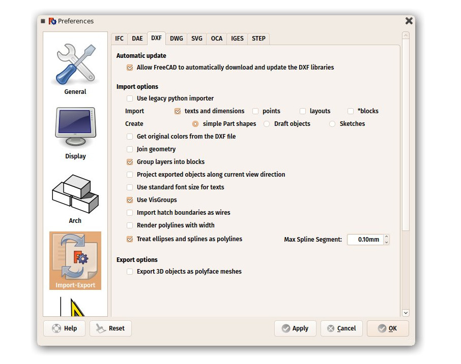

## Import and export to other file formats

FreeCAD can import and export from/to many file formats. Here is a list of the most important ones with a short description of the available features:

| Format | Import | Export | Notes |
| ------ | ------ | ------ | ----- |
| STEP   | Yes    | Yes    | This is the most faithful import/export format available, since it supports solid geometry and NURBS. It is widely used in the engineering world. Use it whenever possible. |
| IGES   | Yes    | Yes    | An older solid-based format, also very well supported. Some older applications don't support STEP but still do IGES. |
| BREP   | Yes    | Yes    | The native format of [OpenCasCade](https://en.wikipedia.org/wiki/Open_Cascade_Technology), FreeCAD's geometry kernel. This format allows 100% compatibility with other OpenCasCade-based applications |
| IFC    | Yes    | Yes    | [Industry Foundation Classes](https://en.wikipedia.org/wiki/Industry_Foundation_Classes), the standard format for [BIM](https://en.wikipedia.org/wiki/Building_information_modeling) models. Requires the installation of [IfcOpenShell](https://wiki.freecadweb.org/Arch_IFC). FreeCAD has excellent compatibility with that format, both at import and export. |
| SVG    | Yes    | Yes    | An excellent, widespread 2D graphics format. Mostly used as an output format by the TechDraw workbench, but FreeCAD can also directly import SVG files and let you use their elements in your models |
| DXF    | Yes    | Yes    | An open format maintained by Autodesk. Since the 3D data inside a DXF file is encoded in a proprietary format, FreeCAD can at the moment only import/export 2D data to/from this format. |
| DWG    | Yes    | Yes    | A proprietary file format. Requires the installation of the [Teigha File Converter](https://www.opendesign.com/guestfiles) utility. This format suffers from the same proprietary limitations as DXF.|
| OBJ    | Yes    | Yes    | A mesh-based format (can only contain triangle- or polygon-based meshes). All solid and NURBS-based objects of FreeCAD will then be converted to mesh on export. An alternative exporter is provided by the Arch workbench, more suited to the export of architectural models. |
| DAE    | Yes    | Yes    | Also called [Collada](https://en.wikipedia.org/wiki/COLLADA). Can only contain meshes. All solid and NURBS-based objects of FreeCAD will be converted to mesh on export. |
| STL    | Yes    | Yes    | Another mesh-based format, commonly used for 3D printing. Can only contain triangulated meshes. All solid and NURBS-based objects of FreeCAD will be converted to mesh on export. |
| PLY    | Yes    | Yes    | An older mesh-based format. Can only contain triangulated meshes. All solid and NURBS-based objects of FreeCAD will be converted to mesh on export. |
| VRML   | Yes    | Yes    | A rather old mesh-based web format. |
| GCODE  | Yes    | Yes    | FreeCAD can import and export to/from several flavors of GCode, (aka RS-274) but only a small number of machines are supported at the moment. |
| CSG    | Yes    | No     | OpenSCAD's [CSG](https://en.wikipedia.org/wiki/Constructive_solid_geometry) (Constructive Solid Geometry) format. |

FreeCAD supports [many more file formats](https://wiki.freecadweb.org/Import_Export). Menu *File → Import* and *File → Export* dialogs will show you all the available options.

Some of these file formats have options. These can be configured from menu *Edit → Preferences → Import/export*:

-----

**Read more**

* All file formats supported by FreeCAD: http://wiki.freecadweb.org/Import_Export
* Working with DXF and DWG files in FreeCAD: http://wiki.freecadweb.org/Draft_DXF
* Working with IFC files in FreeCAD: http://wiki.freecadweb.org/Arch_IFC
* Working with SVG files in FreeCAD: http://wiki.freecadweb.org/Draft_SVG
* OpenCasCade: http://www.opencascade.com
* Teigha File Converter: https://www.opendesign.com/guestfiles
* The IFC format: http://www.buildingsmart-tech.org/ifc/IFC4/final/html/index.htm
* IfcOpenShell: http://ifcopenshell.org/
