## Navigating in the 3D view

### A word about the 3D space

If this is your first contact with a 3D application, you will need to grab some key concepts first. If not, you can safely skip this section.

The FreeCAD 3D space is an [euclidian space](https://en.wikipedia.org/wiki/Euclidean_space). It has an origin point and three axes: X, Y and Z. If you look at your scene from above, conventionally, the increasing, positive, X axis points to the right, the positive Y axis to the back, and the positive Z axis upwards. The [navigation cube](https://wiki.freecadweb.org/Navigation_Cube) and the 3-axes icon in lower right corner of the FreeCAD view always show you from where you are viewing the scene:

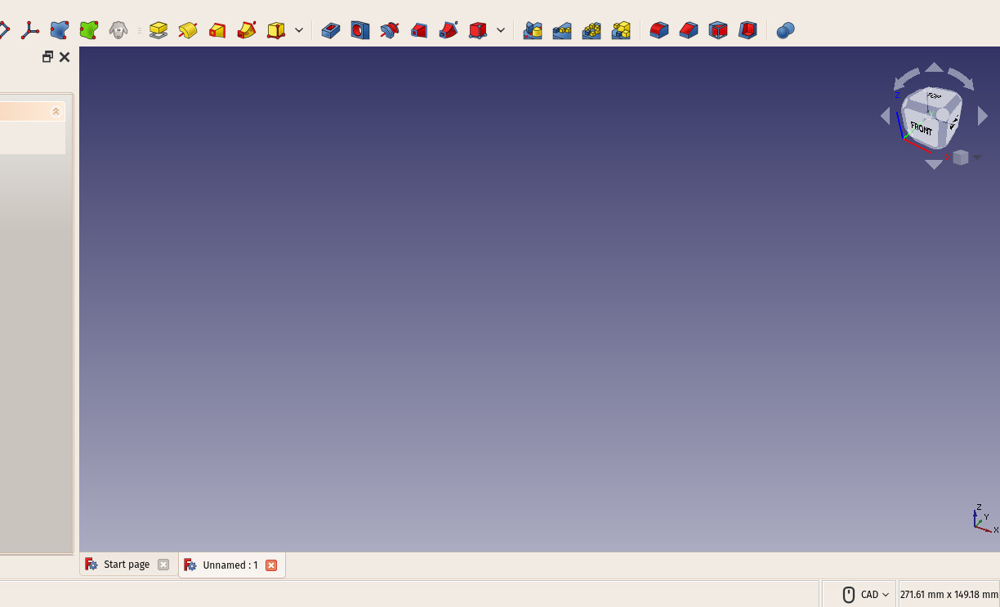 

Every point of every object that exists in that space can be located by its (x,y,z) coordinates. For example, a point with coordinates (2,3,1) will lie at 2 units on the X axis, 3 units on the Y axis, and 1 unit on the Z axis:

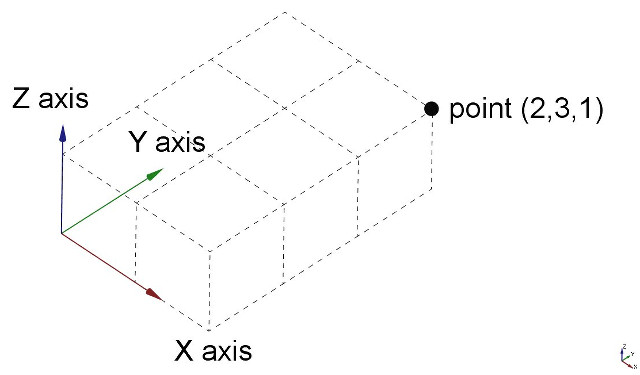

You can look at that scene from any angle, like if you were holding a camera. That camera can be moved left, right, up and down (pan), rotated around what it is looking at (rotate) and brought closer or further from the scene (zoom).

### The FreeCAD 3D view

Navigating in the FreeCAD 3D view can be done with a mouse, a Space Navigator device, the keyboard, a touchpad, or a combination of those. FreeCAD can use several [navigation modes](http://www.freecadweb.org/wiki/index.php?title=Mouse_Model), which determine how the three basic view manipulation operations (pan, rotate and zoom) are done, as well as how to select objects on the screen. Navigation modes are accessed from the Preferences screen, directly by right-clicking anywhere on the 3D view, or using the control button in the status bar at the bottom of the FreeCAD window:

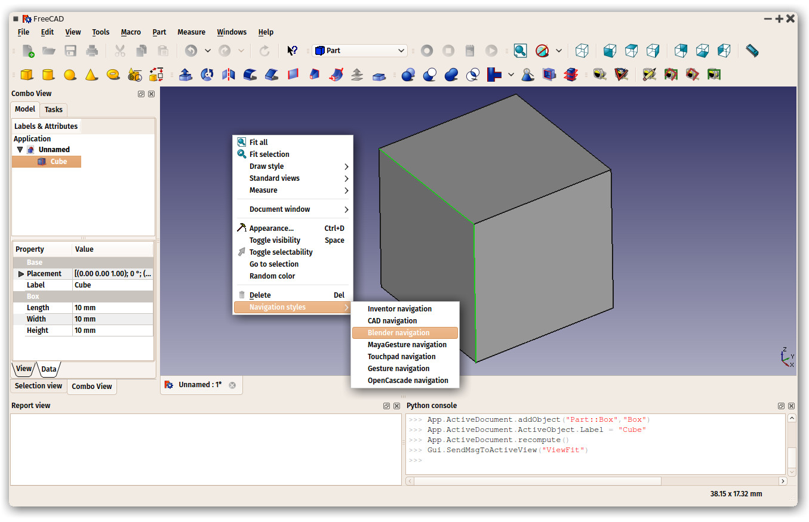

Each of these modes attributes different mouse buttons, or mouse + keyboard combinations, or mouse gestures, to these four operations. The following table shows the principal available modes.

| Mode                          | Pan           | Rotate     | Zoom      | Select     |
| ----------------------------- |:-------------:| :---------:|:---------:|:----------:|
| Inventor | 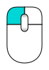 | 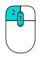 | 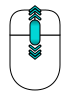 | CTRL +  |
| CAD (default) | 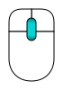 |  |  |  |
| Blender | SHIFT +  |  |  | 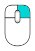 |
| Touchpad | SHIFT + 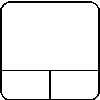 | ALT +  | PGUP / PGDOWN | 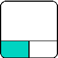 |
| Gesture |  + DRAG |  + DRAG |  |  |
| Maya |  | SHIFT +  |  |  |
| Revit |  | CTRL +  |  |  |

Hovering the mouse over the status bar control button also shows how to use the mouse buttons:

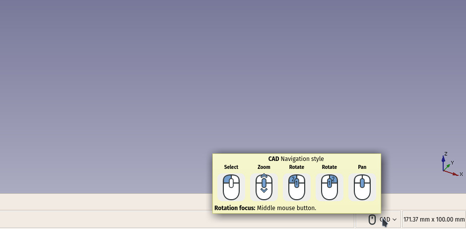

Alternatively, some keyboard controls are always available, no matter the navigation mode: 

 - **CTRL +** and **CTRL -** to zoom in and zoom out 
 - The **arrow keys** to shift (pan) the view left/right and up/down 
- **SHIFT + left arrow** and **SHIFT + right arrow** to rotate the view by 90 degrees 
 - the numeric keys, **1 to 6**, for the six standard views, top, front, right, bottom, back and left
 - **V,O** will switch the camera to orthographic mode, 
 - while **V,P** switches it to perspective mode. 

These controls are also available from the View menu and some from the View toolbar.

### Selecting objects

Objects in the 3D view can be selected by clicking them with the corresponding mouse button, depending on the navigation mode. A single click will select the object, and one of its subcomponents (edge, face, vertex). Double-clicking will select all its subcomponents. You can select more than one subcomponent, or even different subcomponents from different objects, by pressing the **CTRL** key. With multiple items selected, keeping the CTRL key pressed, and pressing a selected item removes it from the selection.  Clicking with the selection button on an empty portion of the 3D view will deselect everything.

A panel called [Selection view](https://wiki.freecadweb.org/Selection_view), available from the View menu, can also be turned on, which shows you what is currently selected,and allows you to search objects by name:

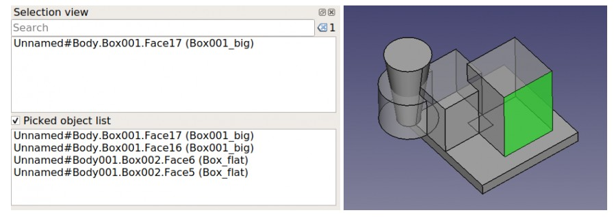 

-----

**Read more**

* The navigation styles: https://wiki.freecadweb.org/Mouse_Model
* The navigation cube: https://wiki.freecadweb.org/Navigation_Cube
* The selection view: https://wiki.freecadweb.org/Selection_view