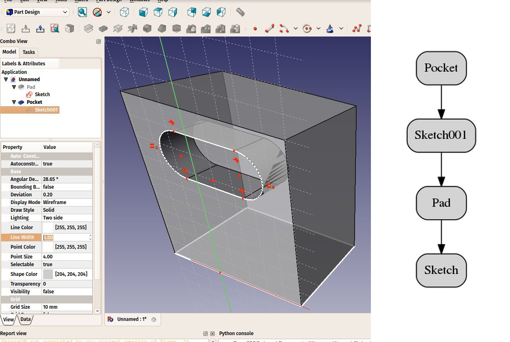

## Parametric objects

FreeCAD is designed for parametric modeling. This means that the geometry that you create, instead of being freely sculptable, is produced by rules and parameters. For example, a cylinder might be produced from a radius and a height. With these two parameters, the program has enough information to build the cylinder.

Parameters are also called **object properties**. All FreeCAD objects have properties. The properties of selected objects can be modified anytime from the [property editor](http://wiki.freecadweb.org/Property_editor) located under the tree view.

Parametric objects, in FreeCAD, are in reality small pieces of a program that run whenever one of the parameters has changed. Objects can have a lot of different kinds of parameters, or properties: numbers (integer numbers like 1, 2, 3 or floating-point values like 3.1416), real-world sizes (1mm, 2.4m, 4.5ft), (x,y,z) coordinates, text strings ("hello!") or even another object.

This last type allows quickly building complex chains of operations, each new object being based on a previous one, adding new features to it.

In the example below, a solid, cubic object (Pad) is based on a rectangular 2D shape (Sketch) and has an extrusion distance. With these two properties, it produces a solid shape by extruding the base shape by the given distance. You can then use this object as a base for further operations, such as drawing a new 2D shape on one of its faces (Sketch001) and then making a subtraction (Pocket), until arriving at your final object. 

All the intermediary operations (2D shapes, pad, pocket, etc) are still there, and you can still change any of their parameters anytime. It's literally one object built by taking and modifying the previous one, where the last one is the final result. The whole chain will be rebuilt (recomputed) whenever needed.

Two important things are necessary to know:

1. **Recomputation** is not always automatic. Heavy operations, that might modify a big portion of your document, and therefore take some time, are not performed automatically. Instead, the object (and all the objects that depend on it) will be marked for recomputation (a small blue  icon appears on them in the tree view). You must then press the recompute button (CTRL+R or menu *Edit → recompute*) to have all the marked objects recomputed. Recomputing will only rebuild what is needed when it is needed, so you can use it very often.
2. The dependency tree like the one shown above must **always flow in the same direction**. Loops are forbidden. You can have object A which depends on object B which depends on object C. But you cannot have object A which depends on object B which depends on object A. That would be a circular dependency. However, you can have many objects that depend on the same object, for example objects B and C both depend on A. An error message will appear in the report view if such a condition is detected, and menu *Tools → Dependency graph* shows you a dependency diagram like the image above, which will highlight any dependency loop found in the document.

Not all geometry is parametric in FreeCAD. Often, the geometry that you import from other files won't contain any parameter, and will be simple, non-parametric objects in FreeCAD. However, these can often be used as a base, or starting point for newly created parametric objects. There are also many tools to convert geometry to other types, and often some or all "parametricity" can be regained.

All objects, however, parametric or not, will have a couple of basic properties, such as a Name, which is unique in the document and cannot be edited, a Label, which is a user-defined name that can be edited, and a  [placement](http://www.freecadweb.org/wiki/index.php?title=Placement), which holds its position in the 3D space.

Finally, it is worth noting that custom parametric objects are [easy to program in python](http://www.freecadweb.org/wiki/index.php?title=Scripted_objects).

## Expressions

-----

**Read more**

* The properties editor: http://wiki.freecadweb.org/Property_editor
* How to program parametric objects: http://wiki.freecadweb.org/Scripted_objects
* Positioning objects in FreeCAD: http://wiki.freecadweb.org/Placement
* Using the dependency graph: http://wiki.freecadweb.org/Std_DependencyGraph
