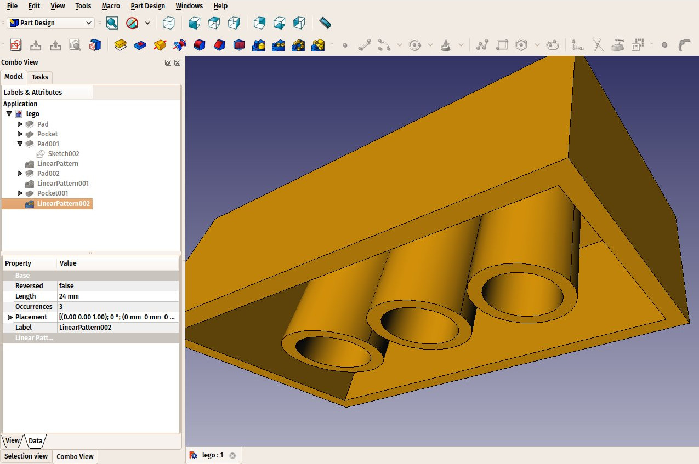
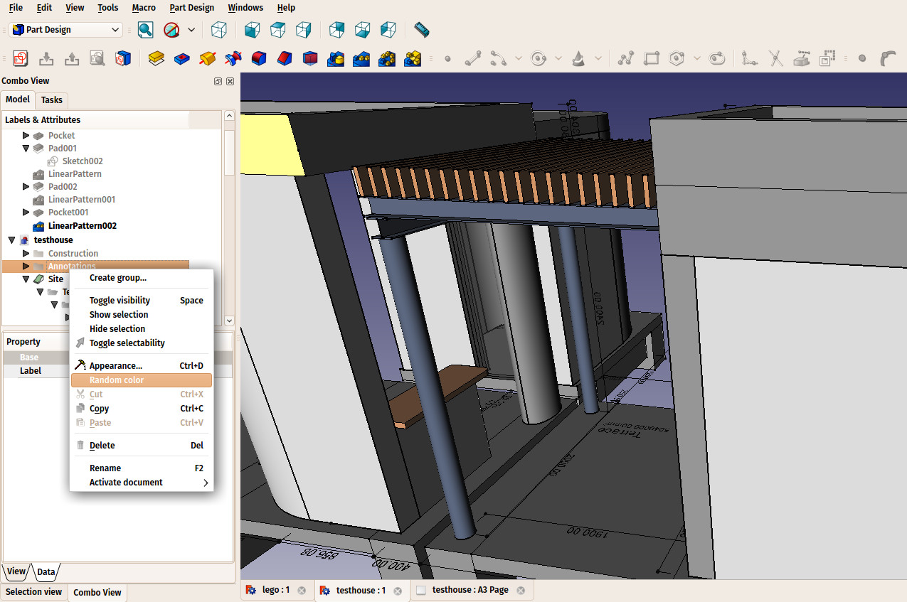

## The FreeCAD document

A FreeCAD document contains all the objects of your scene. It can contain groups and objects made with any workbench. You can switch between workbenches, and still work on the same document and/or objects within that document. The document is what gets saved to disk when you save your work. You can also open several documents at the same time in FreeCAD, and open several views of the same document.

Inside the document, objects can be organized into [groups](https://wiki.freecadweb.org/Std_Group), which are like folders on your computer. Managing groups, objects and object labels is done mainly from the **Tree view**. There, you can create groups, move objects to groups, delete objects or groups. By right-clicking in the tree view or on an object, you can rename objects, change their color, hide or show them, or possibly other operations, depending on the current workbench.

Objects inside a FreeCAD document can be of different types. Each workbench can add its own types of objects, for example the [Mesh Workbench](http://www.freecadweb.org/wiki/index.php?title=Mesh_Module) adds support for [mesh](https://en.wikipedia.org/wiki/Triangle_mesh) objects, the [Part Workbench](http://www.freecadweb.org/wiki/index.php?title=Part_Module) for solid, [BREP](https://en.wikipedia.org/wiki/Boundary_representation)-based objects, etc (these concepts will be better explained later in this manual).  There are even non-geometric objects, that live in the tree, but have no visible existence in the 3D view (Groups are an example of such objects). Objects always live in one specific document. Objects from other documents can be linked into the current document using [Link](https://wiki.freecadweb.org/App_Link) objects.

There is always only one active document at a time. That's the document that appears in the current 3D view, the document you are currently working on. If you switch tabs to another document, that one becomes the active document. Most operations always work on the active document.

FreeCAD documents are saved with the **.FCStd** extension, which is a zip-based compound format, similar to [LibreOffice](https://www.libreoffice.org). If something goes very wrong, it is often possible to unzip it and fix the problem or rescue the data.

-----

**Read more**

* The FreeCAD document: http://wiki.freecadweb.org/Document_structure
* The FCStd file format: http://wiki.freecadweb.org/File_Format_FCStd
* Groups: https://wiki.freecadweb.org/Std_Group
* Link objects: https://wiki.freecadweb.org/App_Link

