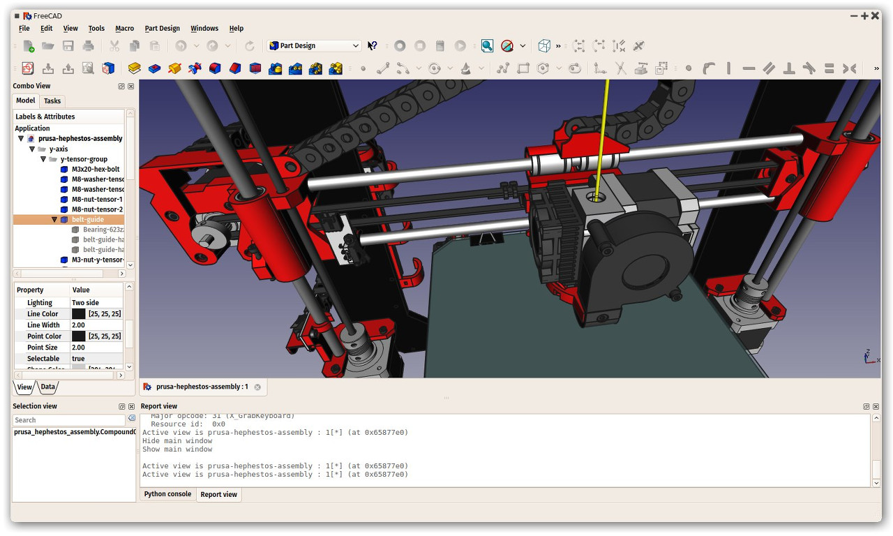

## What is FreeCAD?

FreeCAD is an open-source parametric 3D modeling application, made primarily to design real-life objects. [Parametric modeling](http://en.wikipedia.org/wiki/Parametric_feature_based_modeler) describes a certain type of modeling, where the shape of the 3D objects you design are controlled by parameters. For example, the shape of a brick might be controlled by three parameters: height, width and length. In FreeCAD, as in other parametric modelers, these parameters are part of the object, and stay modifiable at any time, after the object has been created. Some objects can have other objects as parameters, for example you could have an object that takes our brick as input, and creates a column from it. You could think of a parametric object as a small program that creates geometry from parameters.

FreeCAD is not designed for a particular kind of work, or to make a certain kind of objects. Instead, it allows a wide range of uses, and permits users to produce models of all sizes and purposes, from small electronic components to 3D-printable pieces and all the way up to buildings. Each of these tasks have different dedicated sets of tools and workflows available.

FreeCAD is also multiplatform (it runs exactly the same way on Windows, Mac OS and Linux platforms), and it is [open-source](http://en.wikipedia.org/wiki/Open-source_software). Being open-source, FreeCAD benefits from the contributions and efforts of a large community of programmers, enthusiasts and users worldwide. FreeCAD is essentially an application built by the people who use it, instead of being made by a company trying to sell you a product. And of course, it also means that FreeCAD is free, not only to use, but also to distribute, copy, modify, or even sell.

FreeCAD also benefits from the huge, accumulated experience of the open-source world. In its bowels, it includes several other open source components, as FreeCAD itself can be used as a component in other applications. It also possesses all kinds of features that have become a standard in the open-source world, such as supporting a wide range of file formats, being hugely scriptable, customizable and modifiable.  All made possible through a dynamic and enthusiast community of users.

The official website of FreeCAD is at http://www.freecadweb.org

-----

**Read more:**

* About FreeCAD: http://wiki.freecadweb.org/About_FreeCAD
* List of features: http://wiki.freecadweb.org/Feature_list
* Screenshots and user cases: http://forum.freecadweb.org/viewforum.php?f=24
