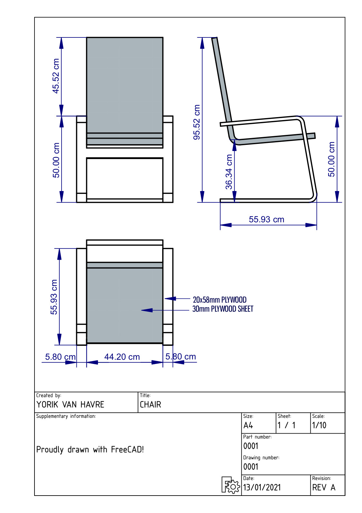
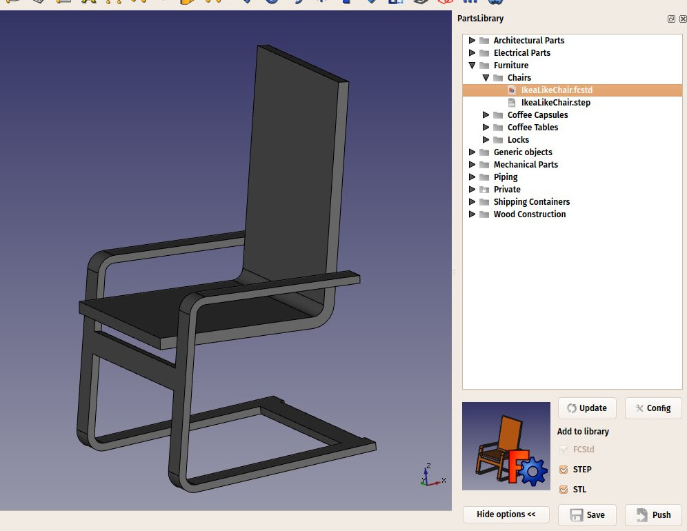

## Generating 2D drawings

When your model cannot be printed or milled directly by a machine, for example it is too big (a building) or it requires manual assembly after the pieces are ready, you will usually need to explain to another person how things fit together. In technical fields (engineering, architecture, etc), this is usually done with drawings, that are handed over to someone else explaining the designer's vision.

Typical examples are [Ikea build instructions](https://www.ikea.com/gb/en/customer-service/product-support/assembly-guides/), [architectural drawings](https://en.wikipedia.org/wiki/Architectural_drawing) or [blueprints](https://en.wikipedia.org/wiki/Blueprint). These drawings usually contain not only the drawing itself, but also many annotations, such as texts, dimensions, numbers, symbols that will help others to understand what needs to be done and how.

In FreeCAD, the workbench responsible for making such drawings is the [TechDraw Workbench](http://www.freecadweb.org/wiki/index.php?title=TechDraw_Module). 

The TechDraw Workbench allows you to create sheets, which use a pre-made [template](http://www.freecadweb.org/wiki/index.php?title=Drawing_templates) containing pre-drawn items on the sheet, such as borders and title block. On these sheets, you can then place [views](http://www.freecadweb.org/wiki/index.php?title=TechDraw_View) of the 3D objects you modeled previously, and configure how these views must appear on the sheet. Finally, you can also place all kinds of annotations on the sheet, such as dimensions, texts, hatch patterns, and other usual symbols commonly used in technical drawings.

Drawing sheets, once complete, can be printed or exported as [SVG](https://en.wikipedia.org/wiki/Scalable_Vector_Graphics), [PDF](https://en.wikipedia.org/wiki/PDF) or [DXF](https://en.wikipedia.org/wiki/AutoCAD_DXF) files.

In the following exercise, we will see how to create a simple drawing of a chair model that you can download from the [FreeeCAD parts library](https://github.com/FreeCAD/FreeCAD-library) or via the link at the bottom of this page. We will create a PDF document like this:

* Start with downloading the step (or FCStd) file from the link provided at the bottom of this page, or directly from the [FreeCAD parts library online repository](https://github.com/FreeCAD/FreeCAD-library/blob/master/Industrial%20Design/Chairs/IkeaLikeChair.step). If you prefer, you can also use any other model, in any format supported by FreeCAD. The [FreeCAD parts library](https://github.com/FreeCAD/FreeCAD-library) is a collection of models created by other FreeCAD users, that you can freely use in your own models. You can browse it online, and download models from there, or install it via the addons manager. In the latter case, a macro will be added to your macros collection, that allows you to open a models browser within FreeCAD.
* Load the chair file in FreeCAD by using menu *File → Open* (to create a new document) or *File → Import* (to add the chair to an existing document), or use the macro provided with the parts library addon, and locate the IkeaLikeChair.step file under *Industrial design → Chairs*:

* Switch to the [TechDraw Workbench](http://www.freecadweb.org/wiki/index.php?title=TechDraw_Module)
* Create a new A4 portrait page by  the small arrow next to the  [New Drawing Page](http://www.freecadweb.org/wiki/index.php?title=Drawing_Landscape_A3) button.
* Select the **A4 Portrait / ISO7200** template. A new tab will open in your FreeCAD window, showing the new page.
* In the tree view (or in the model tab), select the chair model.  Select the whole model, both the seat and the frame.
* Press the  [Insert view](http://www.freecadweb.org/wiki/index.php?title=Drawing_View) button.
* A View object will be created on our page. Highlight both View lines in the Model tree, and click on the Data tab.  Give the view the following properties:
   * X: 100
   * Y: 150
   * Scale: 0.1
   * Rotation: 270
* We now have a nice top view (which is the default projection) of our chair:

* Let's repeat the operation twice, to create two more views. Remember to highlight both items in the Model tree before pressing **Insert View**.  We will set their X and Y values, which indicate the position of the view on the page, in order to show them apart from the top view, and their direction, to create different view orientations. (Again highlight both Views to change both at the same time.) Give each new view the following properties:
   * View002 & 003 (front view): X: 100, Y: 130, Scale: 0.1, Rotation: 90, Direction: (-1,0,0) (click on small arrow to the left of Direction to access values.)
   * View004 & 005 (side view): X: 180, Y: 130, Scale: 0.1, Rotation: 90, Direction: (0,-1,0)
 * After that, we obtain the following page (for some it will seem unnatural for the top view to appear beneath the front view like this):

* We can tweak a bit the aspect of our views if we want, for example we can raise their **Line Width** property to 0.5. (In the Model tree, click on the first View and Shift click on the last View to highlight all of them, Data tab, Line Width property, set to 0.5)
* Now would be a good time for an incremental save.

We will now place dimensions and indications on our drawing. There are two ways to add dimensions to a model, one is placing the dimensions inside the 3D model, using the  [Dimension](http://www.freecadweb.org/wiki/index.php?title=Draft_Dimension) tool of the [Draft Workbench](http://www.freecadweb.org/wiki/index.php?title=Draft_Module), and then place a view of these dimensions on our sheet with the  [Draft View](http://www.freecadweb.org/wiki/index.php?title=Drawing_DraftView) tool (which can be used with a single dimension or a group containing dimensions), or we can do things directly on the Drawing sheet, using the [Drawing Dimensioning Workbench](https://github.com/hamish2014/FreeCAD_drawing_dimensioning), which is available from the [FreeCAD addons](https://github.com/FreeCAD/FreeCAD-addons). We will use this latter method, remembering that dimensions will not update should the model be modified.

* Switch to the [Drawing Dimensioning Workbench](https://github.com/hamish2014/FreeCAD_drawing_dimensioning)
* Press the **Add Linear Dimension** button. Available nodes are highlighted in green on the drawing page:

* Click two of these points, then click a third point to place the dimension line (the mouse scroll wheel will allow zooming in or out as needed):

* The Linear Dimension tool, as most of the other Drawing Dimensioning tools, will not exit after completing a dimension, allowing you to place more dimensions. When you are done, simply click the **Close** button in the Task panel.
* Repeat the operation, until all the dimensions you wish to add are placed. Take a minute to browse through the different options proposed in the Linear Dimension's task panel. The task panel changes will apply to the next dimension added.  For example, by unticking the **auto place text** option, you will be able to place the text of the dimension elsewhere, using a fourth click, like on the image below:

* Let us place two **grab points** in the middle of the areas shown by the arrow tips above.  We will now place two leaders, using the **Welding/Groove symbols** tool, selecting the default one (no groove symbol). Draw the two lines like on the image above.
* Now place two texts using the **Add text** tool, and change their **text** property to your liking.  (Highlight the Text line in the Model tree and in the Data tab, the text property value change to the desired verbiage.)
* Our drawing is now complete, all that is left to do is to enter information into the sheet title block. With most of the default FreeCAD templates, this can be done easily, by changing the **Editable Texts** property of the page. (Highlight the Page line of the Model tree, Data tab, Editable Texts Property, mouse click on the three periods at the end of the value cell. It may take more than one mouse click on the periods.  In the window that pops up, paint the desired text, type new text in its place, making all the desired line changes. Click OK when done.)

Our page can now be exported to SVG to be worked further in graphical applications like [inkscape](http://www.inkscape.org), or to DXF by selecting menu **File → Export**. The Drawing Dimensioning workbench also features its own **DXF export** tool, which also supports the annotations added with that workbench. The DXF format is importable in almost all existing 2D CAD applications. Drawing pages can also be directly printed or exported to PDF.

-----

**Downloads**

* The chair model: https://github.com/yorikvanhavre/FreeCAD-manual/blob/master/files/chair.step
* The file created during this exercise: https://github.com/yorikvanhavre/FreeCAD-manual/blob/master/files/drawing.FCStd
* The SVG sheet produced from that file: https://github.com/yorikvanhavre/FreeCAD-manual/blob/master/files/drawing.svg

**Scripting with 2D Drawings**
To script with 2D drawings can be a challenging process. For the moment we will discuss this with the 0.16 version of FreeCAD. In general, you can only place one part onto the sheet, so you will need to recursively compound your various parts into 1 part. The second difficulty in producing automated drawings is in the placement of the views. In general there is a way to dump SVG of 1 view, but not of all the views at once. As such, you need to selectively dump the SVG of the views you are after, and then place them onto the SVG of the drawing sheet with SVG methods. 

**Read more**

* The Drawing Workbench: http://www.freecadweb.org/wiki/index.php?title=Drawing_Module
* The Drawing Dimensioning Workbench: https://github.com/hamish2014/FreeCAD_drawing_dimensioning
* The FreeCAD library: https://github.com/FreeCAD/FreeCAD-library
* Inkscape: http://www.inkscape.org
