## Modeling for product design

[Product design](https://en.wikipedia.org/wiki/Product_design) is originally a commercial term, but in the 3D world, it often means modeling something with the idea to have it [3D-printed](https://en.wikipedia.org/wiki/3D_printing) or, more generally, manufactured by a machine, being a 3D printer or a [CNC machine](https://en.wikipedia.org/wiki/Numerical_control).

When you print objects in 3D, it is of ultimate importance that your objects are **solid**. As they will become real, solid objects, this is obvious. Nothing prevents them from being hollow inside, of course. But you always need to have a clear notion of which point is inside the material, and which point is outside, because the 3D printer or the CNC machine needs to know exactly what is filled with material and what is not. For this reason, in FreeCAD, the [Part Design Workbench](http://www.freecadweb.org/wiki/index.php?title=PartDesign_Workbench) is the perfect tool to build such pieces, because it will always verify that your objects stay solid and buildable, and warn you if you perform an operation that prevents this.

To illustrate how the PartDesign Workbench works, let's model this well-known [LEGO](https://en.wikipedia.org/wiki/Lego)® brick: 

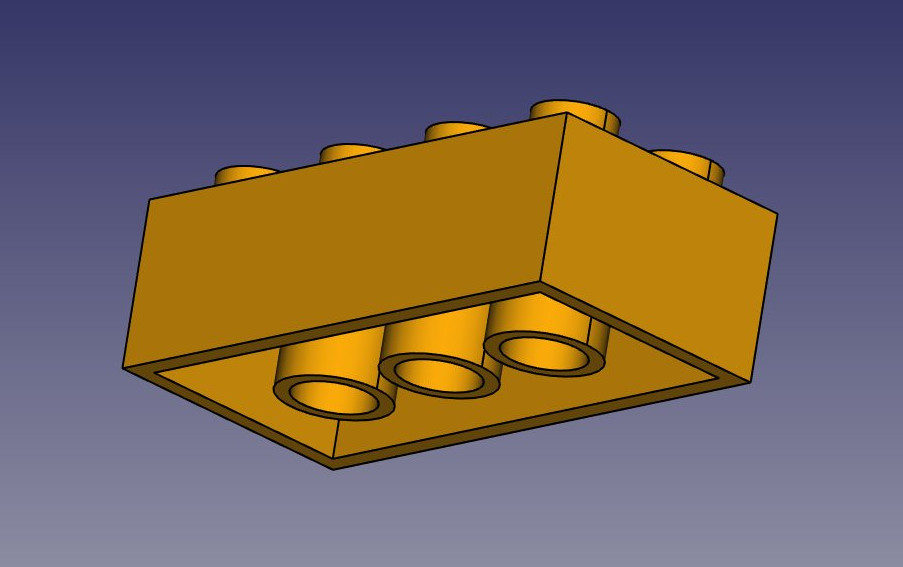

The cool thing with LEGO® bricks is that the dimensions are easy to obtain on the internet, at least for the standard pieces. These are pretty easy to model and print on a 3D printer, and with a bit of patience (3D printing often requires much adjustment and fine-tuning) you can make pieces that are totally compatible and click perfectly into original bricks.  In the example below, we will make a piece that is 1.5 times bigger than the original. This is solely for the purpose of this exercise of course, as it will make our piece incompatible with the original pieces.

We will now use exclusively the [Sketcher](http://www.freecadweb.org/wiki/index.php?title=Sketcher_Module) and [Part Design](http://www.freecadweb.org/wiki/index.php?title=PartDesign_Workbench) tools. Since all the tools from the Sketcher Workbench are also included in the Part Design Workbench, we can stay in Part Design and we will not need to switch back and forth between the two.

Part Design objects are fully based on **Sketches**. A Sketch is a 2D object, made of linear segments (lines, arcs of circle or ellipses) and constraints. These constraints can be applied either on linear segments or on their endpoints or center points, and will force the geometry to adopt certain rules. For example, you can place a vertical constraint on a line segment to force it to stay vertical, or a position (lock) constraint on an endpoint to prohibit it from moving. When a sketch has the exact number of constraints that prohibits any point of the sketch to be moved, we talk about a fully constrained sketch. When there are redundant constraints, where one could be removed without allowing the geometry to be moved, it is called over-constrained. This should be avoided, and FreeCAD will notify you if such case occurs.

Sketches have an edit mode, where their geometry and constraints can be changed. When you are done with editing, and leave edit mode, sketches behaves like any other FreeCAD object, and can be used as building blocks for all the Part Design tools, but also in other workbenches, such as [Part](http://www.freecadweb.org/wiki/index.php?title=Part_Module) or [Arch](http://www.freecadweb.org/wiki/index.php?title=Arch_Module). The [Draft Workbench](http://www.freecadweb.org/wiki/index.php?title=Draft_Module) also has a tool that converts Draft objects to Sketches, and vice-versa.

* Let's start by modeling a cubic shape that will be the base of our brick. Later on we will carve the insides, and add the 8 dots on top of it. So let's start this by making a rectangular sketch that we will then extrude:
* Switch to the [Part Design Workbench](http://www.freecadweb.org/wiki/index.php?title=PartDesign_Workbench)
* Create a [body](https://wiki.freecadweb.org/PartDesign_Body). A body is a basic PartDesign container. It typically holds one object, made of a series of operations.
* Click on the  [New Sketch](http://www.freecadweb.org/wiki/index.php?title=Sketcher_NewSketch) button. A dialog will appear asking where you want to place the sketch, choose the **XY** plane, which is the "ground" plane. The sketch will be created and will immediately be switched to edit mode, and the view will be rotated to look at your sketch orthogonally. If you happen to leave the sketch edit mode and find yourself back into the model tree, double-clicking the sketch in the tree will get you back into edit mode.   
* Now we can draw a rectangle, by selecting the  [Rectangle](http://www.freecadweb.org/wiki/index.php?title=Sketcher_Rectangle) tool and clicking 2 corner points. You can place the two points anywhere, since their correct location will be set in the next step.
* You will notice that a couple of constraints have automatically been added to our rectangle: the vertical segments have received a vertical constraint, the horizontal ones a horizontal constraint, and each corner a point-on-point constraint that glues the segments together. Constraints appear in the "Constraints" panel on the Task tab, and can be edited or deleted from there.
* Right-click anywhere on the view background to exit the rectangle tool.

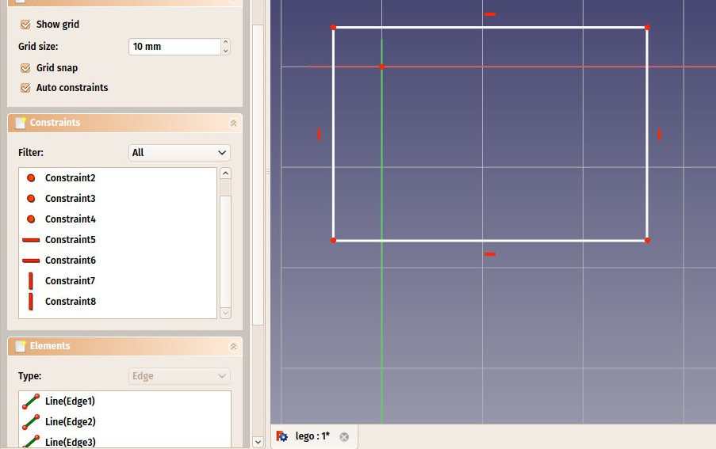

* Now, let's add three more constraints:
   * Select one of the vertical segments (notice the color change to identify the item) and add a  [Vectical Distance Constraint](http://www.freecadweb.org/wiki/index.php?title=Constraint_VerticalDistance). Give it a size of 23.7mm.
   
   * Select one of the horizontal segments and add a  [Horizontal Distance Constraint](http://www.freecadweb.org/wiki/index.php?title=Constraint_HorizontalDistance). Make it 47.7mm.
   
   * Finally, select one of the corner points, then the origin point (which is the dot at the crossing of the red and green axes), then add a  [Point-on-Point Constraint](http://www.freecadweb.org/wiki/index.php?title=Constraint_PointOnPoint).
   

When adding the last constraint, the rectangle will jump to the origin point and your sketch will turn green, meaning it is now fully constrained. You can try moving its lines or points, nothing will move.  

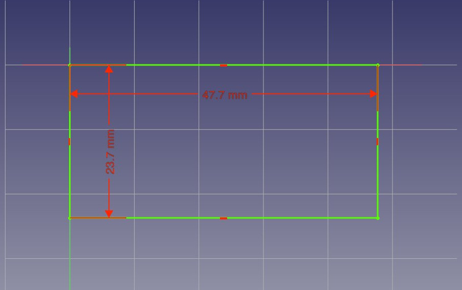

Note that the last point-on-point constraint was not absolutely necessary. You are never forced to work with fully constrained sketches. However, if we are going to print this block in 3D, it will be necessary to maintain our piece close to the origin point (which will be the center of the space where the printer head can move). By adding that constraint we are making sure that our piece will always stay "anchored" to that origin point. It is a good habit to take.

* Our base sketch is now ready, we can leave edit mode by pressing the **Close** button on top of its task panel, or simply by pressing the **Escape** key. If needed later on, we can reenter edit mode anytime by double-clicking the sketch in the tree view.
* Let's extrude it by using the  [Pad](http://www.freecadweb.org/wiki/index.php?title=PartDesign_Pad) tool, and giving it a distance of 14.4mm. (Make sure the Sketch item is highlighted in the model tree.) The other options can be left at their default values.  If we click on the Axonometric View icon we can see the brick taking shape:

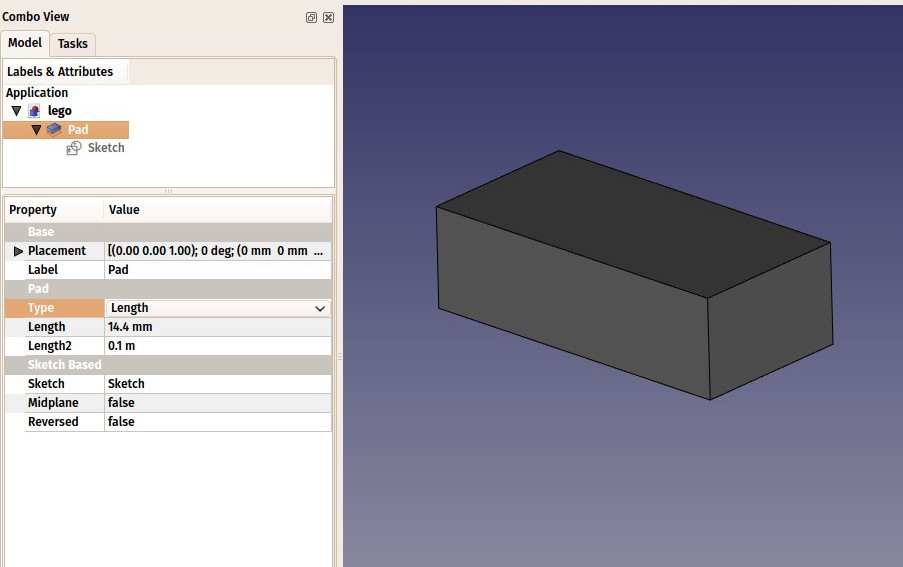

The **Pad** behaves very much like the [Part Extrude](http://www.freecadweb.org/wiki/index.php?title=Part_Extrude) tool that we used in the previous chapter. There are some differences, though, the main one being that a pad cannot be moved. It is attached forever to its sketch. If you want to change the position of the pad, you must move the base sketch. In the current context, where we want to be sure nothing will move out of position, this is an additional security.

* We will now carve the inside of the block, using the  [Pocket](http://www.freecadweb.org/wiki/index.php?title=PartDesign_Pocket) tool, which is the PartDesign version of [Part Cut](http://www.freecadweb.org/wiki/index.php?title=Part_Cut). To make a pocket, we will create a sketch on the bottom face of our block, which will be used to remove a part of the block.
* Rotate the view so you are able to see the bottom side of our object, and click the bottom face to select it.
* Press the  [New Sketch](http://www.freecadweb.org/wiki/index.php?title=Sketcher_NewSketch) icon. Notice that our new sketch will be placed on the selected face.
* Draw a rectangle on the face.

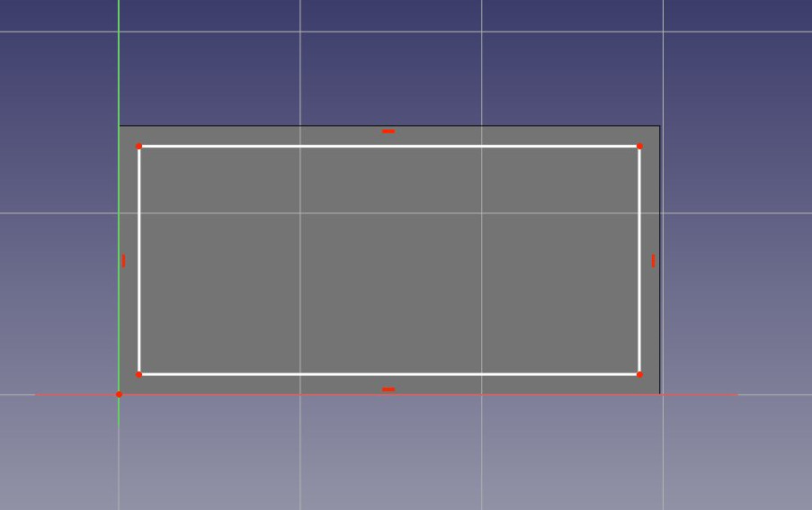

* We will now constrain the rectangle in relation to the bottom face. To do this, we need to "import" some edges of the face with the  [External geometry](http://www.freecadweb.org/wiki/index.php?title=Sketcher_External) tool. Use this tool on the two vertical lines of the bottom face:

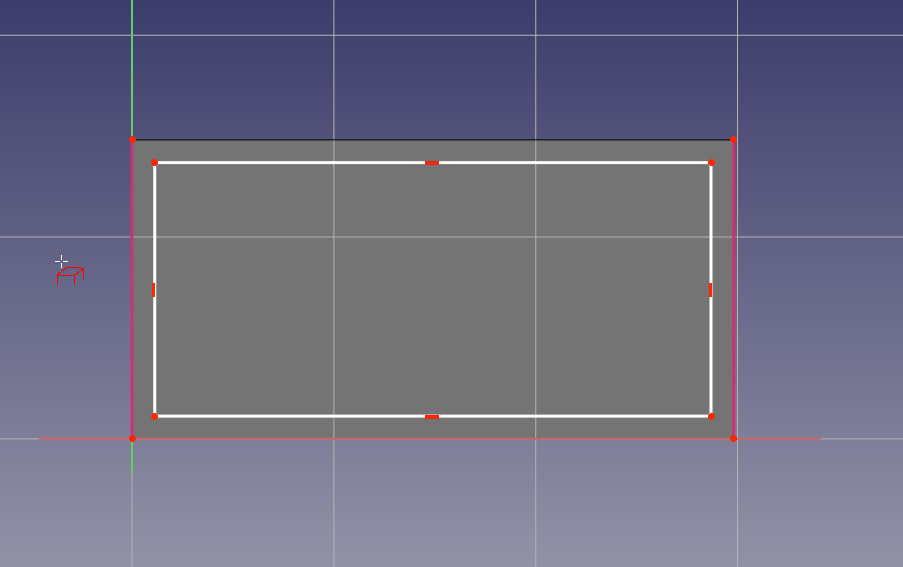

As with other Sketcher tools, when you are finished, right-click to exit the External geometry tool.

You will notice that only edges from the the base face can be added by this tool. When you create a sketch with a face selected, a relation is created between that face and the sketch, which is important for further operations. You can always remap a sketch to another face later with the  [Map Sketch](http://www.freecadweb.org/wiki/index.php?title=Sketcher_MapSketch) tool.

* The external geometry is not "real", it will be hidden when we leave edit mode. But we can use it to place constraints. Place the 4  following constraints:
   * Select the upper left corner of the new rectangle and the upper end point of the left imported line and add a  [Horizontal Distance Constraint](http://www.freecadweb.org/wiki/index.php?title=Constraint_HorizontalDistance) of 1.8mm
   * Select again the two upper left points of the rectangle and line and add a  [Vectical Distance Constraint](http://www.freecadweb.org/wiki/index.php?title=Constraint_VerticalDistance) of 1.8mm
   * Select the lower right corner of the new rectangle and the lower end point of the right imported line and add a  [Horizontal Distance Constraint](http://www.freecadweb.org/wiki/index.php?title=Constraint_HorizontalDistance) of 1.8mm
   * Select again the two lower right points of the rectangle and the  line and add a  [Vectical Distance Constraint](http://www.freecadweb.org/wiki/index.php?title=Constraint_VerticalDistance) of 1.8mm
   
   Note you can move the constraint dimensions by hovering the cursor over the dimension and if it changes color, select and hold the dimension and move it to a more visible position and release the mouse button.

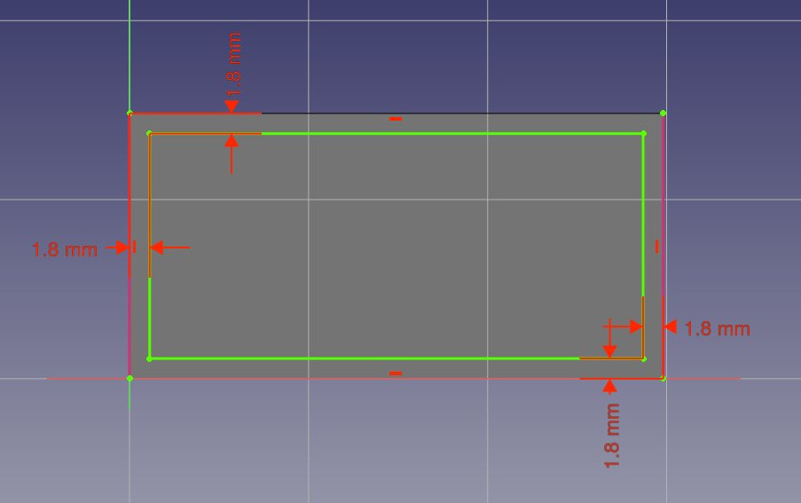

* Select Close to leave edit mode and we can now perform the pocket operation: With the latest sketch selected in the Model tree, press the  [Pocket](http://www.freecadweb.org/wiki/index.php?title=PartDesign_Pocket) buttton. Give it a length of 12.6mm, which will leave the upper face of our pad with a thickness of 1.8mm (remember, the total height of our pad was 14.4mm).

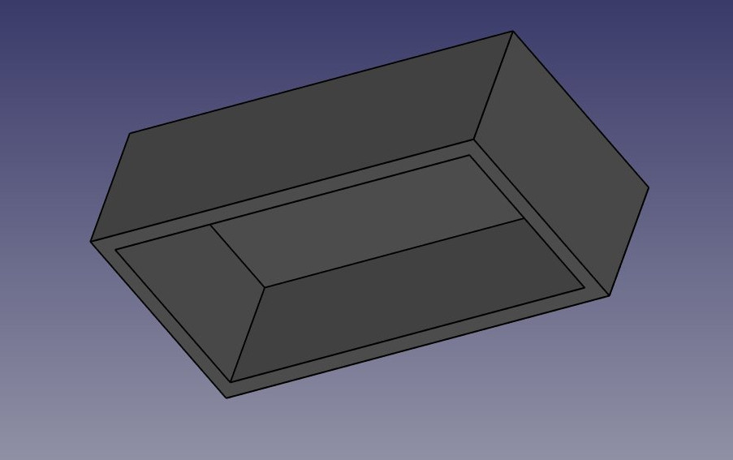

* Now would be a good time for an incremental save.
* We will now attack the 8 dots on the top face. To do this, since they are a repetition of a same feature, we will use the handy  [Linear Pattern](http://www.freecadweb.org/wiki/index.php?title=PartDesign_LinearPattern) tool of the Part Design Workbench, which allows us to model once and repeat the shape.
* Start by selecting the top face of our block
* Create a  [New Sketch](http://www.freecadweb.org/wiki/index.php?title=Sketcher_NewSketch).
* Create two  [circles](http://www.freecadweb.org/wiki/index.php?title=Sketcher_Circle).  Right mouse click to exit the add another circle mode.
* Add a  [Radius Constraint](http://www.freecadweb.org/wiki/index.php?title=Constraint_Radius) of 3.6mm to each of them.  You can select the first circle press **Ctrl **and select the second to set both at the same time.
* Import the left edge of the top face with the  [External geometry](http://www.freecadweb.org/wiki/index.php?title=Sketcher_External) tool.  Right mouse click to exit the Add External Geometry tool.
* Place two vertical constraints and two horizontal constraints of 6mm between the center point of each circle and the corner points of the imported edge, so each circle has its center at 6mm from the border of the face.  Select the center of the circle, and the end point of the imported line and select the desired constraint.  Move the constraints texts into a better position if needed:

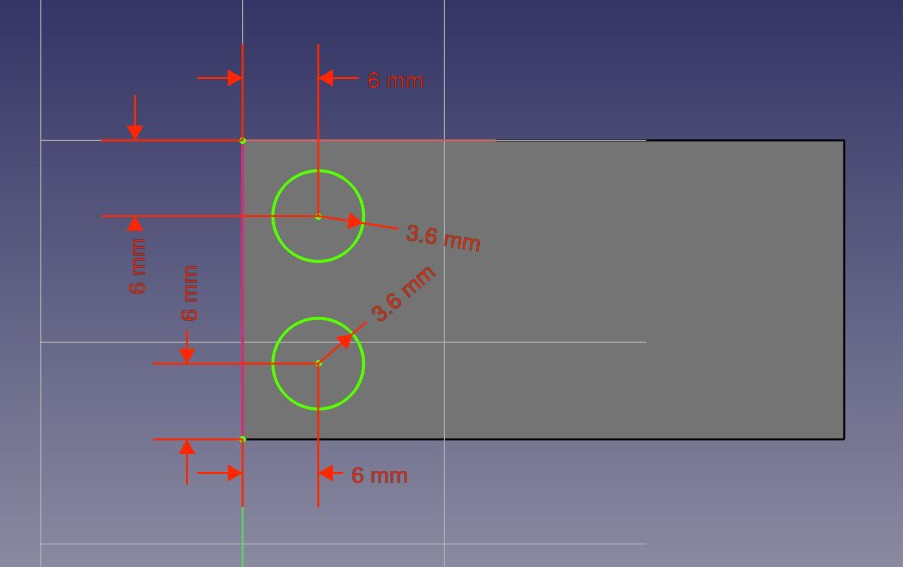

* Notice how, once again, when you lock the position and dimension of everything in your sketch, it becomes green, which means fully constrained. This always keeps you on the safe side. You could change the first sketch now, everything we did afterwards would keep tight. The task panel will also show you useful information, for example if your sketch is overcontrained.
* Leave edit mode (press the "Close" button in the task panel), select this new sketch (highlight it in the model tree) and create a  [Pad](http://www.freecadweb.org/wiki/index.php?title=PartDesign_Pad) of 2.7mm.  Rotate the view to admire the result:

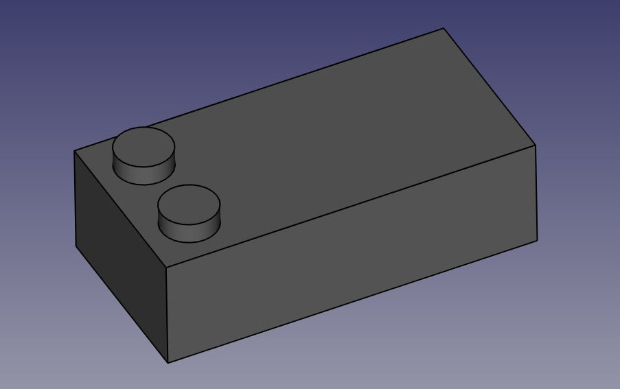

* Notice that, as earlier with the pocket, since we used the top face of our base block as a base for this latest sketch, any PartDesign operation we do with this sketch will correctly be built on top of the base shape: Although they appear as a separate feature in the model tree, the two dots are not an independent object, they have been extruded directly from our brick. This is the great advantage of working with the Part Design workbench: As long as you take care of always building one step on top of the previous one, you are actually building one single final solid object.
* We can now duplicate our two dots four times, so we get eight: Select the Pad we created in the last step in the model tree.
* Press the  [Linear Pattern](http://www.freecadweb.org/wiki/index.php?title=PartDesign_LinearPattern) button.
* Give it a length of 36mm (which is the total "span" we want our copies to fit in), in the "horizontal sketch axis" direction, and make it 4 occurrences.  Select OK to exit:

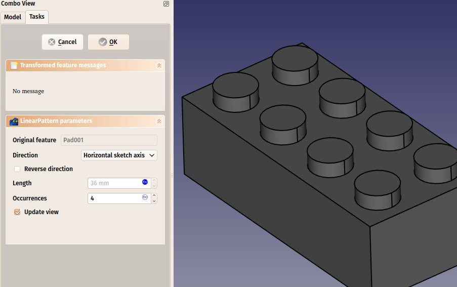

* Once again, see that this is not just a duplication of an object, it is a *feature* of our shape that has been duplicated, the final object is still only one solid object.
* Now let's work on the three "tubes" that fill the void we created on the bottom face. We have several possibilities: create a sketch with three circles, pad it then pocket it three times, or create a base sketch with one circle inside the other and pad it to form the complete tube already, or even other combinations. As always in FreeCAD, there are many ways to achieve the same result. Sometimes one way will not work the way we want, and we must try other way. Here, we will take the safest approach, and do things one step at a time.
* Select the face that is at the bottom of the hollow space we carved earlier inside the block. That is, the "inner rectangle".
* Create a new sketch, add a circle with a radius of 4.8825mm (right click to exit Add Circle mode,) import the left border of the face (right click to exit the Add External Geometry mode,) and constrain the circles center vertically and horizontally at 10.2mm from the upper corner of the face.  Move the constraint dimensions to make them more visible:

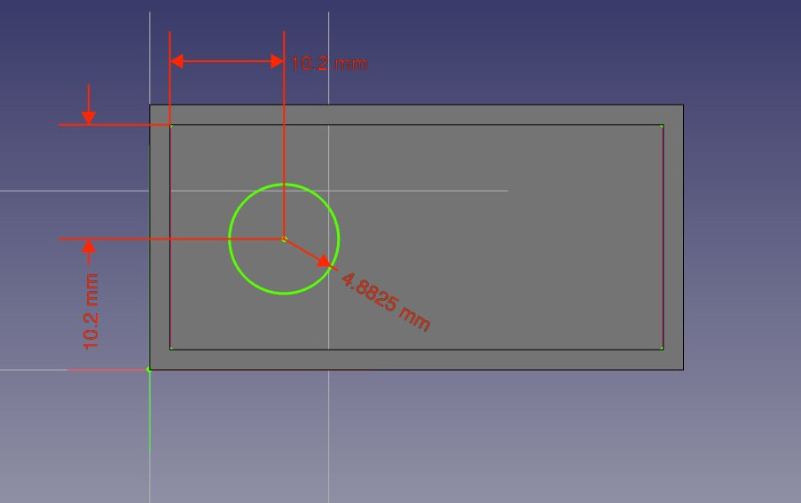

* Click Close to leave edit mode and create a pad from this last sketch with a distance of 12.6mm.  You may want to rotate the model slightly to confirm the change. 
* Create a linear pattern from this last pad, give it a length of 24mm in the horizontal sketch axis direction and 3 occurrences. We now have three filled tubes filling the hollow space:

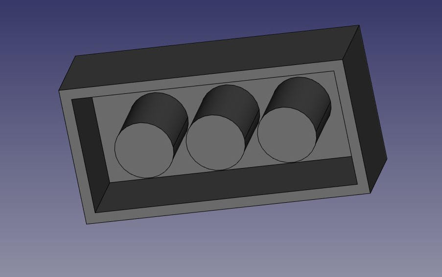

* Now let's make the final holes. Select the circular face of the first of our three "pins"
* Create a new sketch, import the circular boder of our face, create a circle with a radius constraint of 3.6mm, and add a  [Point-on-Point Constraint](http://www.freecadweb.org/wiki/index.php?title=Constraint_PointOnPoint) between the center of the imported circle and our new circle. We now have a perfectly centered circle, and once again fully constrained:

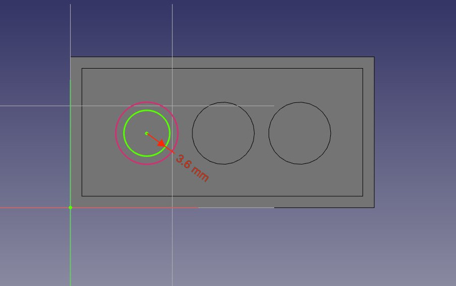

* Click on Close to leave edit mode, and create a pocket from this sketch, with a length of 12.6mm, click on OK to exit.
* Create a linear pattern from this pocket, with a length of 24mm and 3 occurrences. That's the last step, our piece is now complete, we can give it a nice color of Victory! Select the last linear pattern feature in the model tree, locate the Shape Color property under the View tab, click in the value field and select an appropriate color:

You will notice that our modeling history (what appears in the tree view) has become quite long. This is precious because every single step of what we did can be changed later on. Adapting this model for another kind of brick, for example one with 2x2 dots, instead of 2x4, would be a piece of cake, we would just need to change a couple of dimensions and the number of occurrences in linear patterns. We could as easily create bigger pieces that don't exist in the original LEGO® set.

But we could also delete the history, for example if we are going to model a castle with this brick, and we don't want to have this whole history repeated 500 times in our file.

There are two simple ways to get rid of the history, one is using the [Create simple copy](http://www.freecadweb.org/wiki/index.php?title=Part_CreateSimpleCopy) tool from the [Part Workbench](http://www.freecadweb.org/wiki/index.php?title=Part_Module), which will create a copy of our piece that doesn't depend on the history (you can delete the whole history afterwards), the other way is exporting the piece as a STEP file and re-importing it.

#### Assembling

But the best of both worlds also exists, which is to create assemblies. An assembly allows you build a file with simple copies of objects from other files. This way, we can keep our precious building history in one file, and reuse the final result in other files withoout clogging it with all the history of each piece.

While FreeCAD still doesn't ship with a built-in, offcial assembly workbench, several assembly workbenches are available as add-ons: [A2Plus](https://github.com/kbwbe/A2plus) is the oldest one, but is still widely used among the FreeCAD community. [Assembly3](https://github.com/realthunder/FreeCAD_assembly3) is what will probably become the official, built-in version in the future, but is currently not installable via the add-on manager, and [Assembly4](https://github.com/Zolko-123/FreeCAD_Assembly4) which is a Python version of Assembly3 and works much the same way.

In this exercise, we will use A2Plus, because Assembly3 is not as easy toinstall and Assembly4 doesn't work on older versions of FreeCAD. But the steps described below are very similar in all 3 workbenches. All these workbenches also feature additional constraint tools to position objects relative to each other. This is usually preferred than using tools like  [Draft Move](http://www.freecadweb.org/wiki/index.php?title=Draft_Move) and  [Draft Rotate](http://www.freecadweb.org/wiki/index.php?title=Draft_Rotate) as the position of the pieces will adapt automatically if one of the piece changes.

* Save our brick file. We will create a new file for our assembly.
* Install the [A2Plus workbench](https://github.com/kbwbe/A2plus) from menu *Tools → Addons Manager* and restart FreeCAD
* Create a new empty document
* Switch to the **A2Plus workbench**
* Press the  **Import a part from another FreeCAD document** button
* Select the brick file we saved earlier. A2Plus will ask you to save the current empty file first, since it needs to calculate relative paths.
* The final piece will be imported in the current document. The A2Plus workbench will automatically find the final piece in our file, and the new object stays linked to the file. If we go back and modify the contents of the first file, we can press the **Update parts imported into the assembly** button anytime to update the pieces here.
* With our first imported piece selected, press the  **Duplicate part** button three times to obtain four pieces. Each time you create a copy, you will need to click somewhere on screen to drop the copies.
* Give a different color to each piece so we recognize them easier, by changing their **Shape Color** property under the View tab.

We could now use the different constraints tools offered by the A2Plus workbench, such as "face on face", "vertex on line", etc... to position our objects. However, in this case, we don't have any common anchor point on these pieces, so it will be a complicated operation. Instead, it will be much faster to use the Draft move and rotate tools to position our pieces:

* Switch to the **Draft workbench**.
* Make sure **Endpoint** and **Midpoint** snaps are activated
* Select the red piece. Use  [Draft Move](http://www.freecadweb.org/wiki/index.php?title=Draft_Move) and move it from one of its corner points to the midpoint of  the corresponding top edge of the yellow piece
* Repeat this with the green piece
* Select the blue piece, put you in top view. Use  [Draft Rotate](http://www.freecadweb.org/wiki/index.php?title=Draft_Rotate) and give it a 90° rotation, by clicking a first point anywhere to define the rotation center, a horizontal position to give the start angle (press SHIFT while moding the mouse), then a vertical position (release and press SHIFT again) to define a 90° angle.
* Move the blue piece into position like we did with the other pieces.

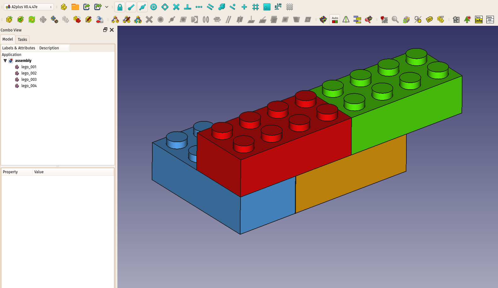

-----

**Downloads**

* The base model produced during this exercise: https://github.com/yorikvanhavre/FreeCAD-manual/blob/master/files/lego.FCStd
* The final assembly produced during this exercise: https://github.com/yorikvanhavre/FreeCAD-manual/blob/master/files/assembly.FCStd

**Read more**

* The Sketcher: http://wiki.freecadweb.org/Sketcher_Module
* The Part Design Workbench: http://wiki.freecadweb.org/PartDesign_Workbench
* The A2Plus Workbench: https://github.com/kbwbe/A2plus

**Disclaimer**

LEGO® is a trademark of the LEGO Group of companies which does not sponsor, authorize or endorse this manual. The use of the LEGO name is permitted by their [Fair play use document](https://www.lego.com/en-us/legal/notices-and-policies/fair-play/)