##  Traditional 2D drafting

You might be interested in FreeCAD because you already have some technical drawing experience, for example with software like [AutoCAD](https://en.wikipedia.org/wiki/AutoCAD), or you already know something about design, or you prefer to draw things before building them. In any case, FreeCAD features a more traditional workbench, with tools found in most 2D CAD applications: The [Draft workbench](http://www.freecadweb.org/wiki/index.php?title=Draft_Module).

The Draft workbench, although it adopts ways of working inherited from the traditional 2D CAD world, is not limited to the 2D realm. All its tools work in the whole 3D space and many of the Draft tools, for example  [Move](http://www.freecadweb.org/wiki/index.php?title=Draft_Move) or  [Rotate](http://www.freecadweb.org/wiki/index.php?title=Draft_Rotate), are commonly used elsewhere in FreeCAD because they are often more intuitive than changing placement parameters manually. like we did in the previous chapter.

Among the tools offered by the Draft workbench, you will find traditional drawing tools like  [Line](http://www.freecadweb.org/wiki/index.php?title=Draft_Line),  [Circle](http://www.freecadweb.org/wiki/index.php?title=Draft_Circle), or  [Polyline](http://www.freecadweb.org/wiki/index.php?title=Draft_Wire), and modification tools like  [Move](http://www.freecadweb.org/wiki/index.php?title=Draft_Move),  [Rotate](http://www.freecadweb.org/wiki/index.php?title=Draft_Rotate) or  [Offset](http://www.freecadweb.org/wiki/index.php?title=Draft_Offset). Draft also contains a [working plane/grid system](http://www.freecadweb.org/wiki/index.php?title=Draft_SelectPlane) that allows you to define precisely in which plane you are working, a [layers system](https://wiki.freecadweb.org/Draft_Layer) to organize your drawing (we will use groups instead in this exercise), and a complete [snapping system](http://www.freecadweb.org/wiki/index.php?title=Draft_Snap) that makes it very easy to draw and position elements precisely in relation to each other.

To showcase the working and possibilities of the Draft workbench, we will walk through a simple exercise, the result of which will be this little drawing, showing the floor plan of a small house that contains only a kitchen counter top (A pretty absurd floor plan, but we can do what we want here, can't we?):

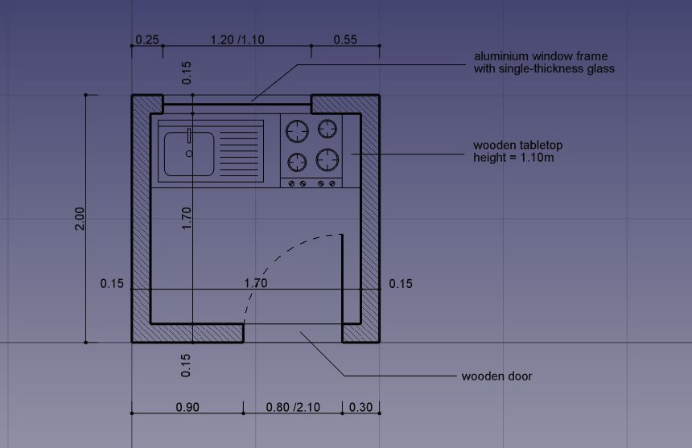

We will assume in this chapter that the table modeling exercise from the previous chapter has been preformed, so we will skip some basic explanations we already viewed there.

#### Setup

* Start FreeCAD, create a new drawing,  and switch to the **Draft Workbench**
* As in all technical drawing applications, it is wise to set up your environment correctly, beforehand, it will save a lot of time. Configure the [grid and working plane](http://www.freecadweb.org/wiki/index.php?title=Draft_SelectPlane), [text](http://www.freecadweb.org/wiki/index.php?title=Draft_Text) and [dimensions](http://www.freecadweb.org/wiki/index.php?title=Draft_Dimension) settings to your liking in menu *Edit → Preferences → Draft*.

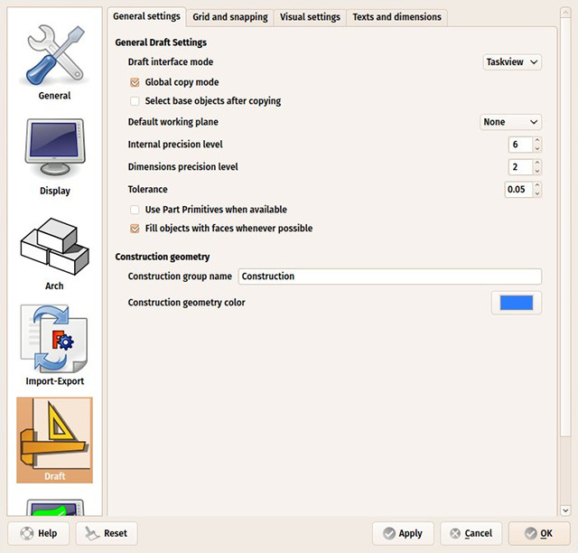

* For this exercise, let us set, under the **Texts and Dimensions** tab, the default **Font Size** to 10cm, and the **Arrow Size** to 2cm. Optionally, turn **Show Unit** off, and set **Override Unit** to "m" to show our dimensions in meters.
* Under the **Grid and Snapping** tab, set the **Grid Spacing** to 10cm, with a main line every 10 squares. This will give us a grid with small squares of 10cm, with a main line every meter.
* The Draft Workbench also has two special toolbars: One with **visual settings**, where you can change the current working plane and layer, turn [construction mode](http://www.freecadweb.org/wiki/index.php?title=Draft_ToggleConstructionMode) on/off, set the line color, face color, line weight and text size to be used for new objects, and another one with **snap locations**. There, you can turn the grid on/off and set/unset individual [Snap locations](http://www.freecadweb.org/wiki/index.php?title=Draft_Snap). Snaps allow us to precisely set the position of a mouse click based on established geometry, such as the midpoint of a line, the intersection of two lines, the end of a line and several other interesting positions.

* Let's start by turning **construction mode** on, using the  icon which will allow us to draw some guidelines, locating features of our final geometry.
* Set the **working plane** to top position: Click on the button showing *Auto* and select **XY (Top)**. When left in Auto, the working plane changes automatically to the current view.  You would therefore need to make sure you are in top view whenever you wanted to draw on the XY plane (the "ground" plane). By setting it to a defined position such as Top, it will stay there, no matter the view angle, until we change it manually or set it back to "Auto". Since we are going to work exclusively in a single 2D plane in this exercise, this is a good first step to do. The grid always shows where the working plane is located.
* Make sure the **grid** and **endpoint** snap positions are activated, as we will use them often. You can activate other snap positions too.

#### Drawing the construction geometry

* We will start by drawing two rectangles in construction mode, to serve as guidelines for our walls. Select the  [Rectangle](http://www.freecadweb.org/wiki/index.php?title=Draft_Rectangle) tool and draw a rectangle, starting at point (0,0,0), of 2 meters by 2 meters:
    * Enter the start point by clicking at the center of the grid, or entering coordinates X:0, Y:0, Z:0 in the Tasks tab, then press Enter.
    * Enter the opposite point of our rectangle by clicking another point at 2 big squares by two big squares away from the origin point, or entering coordinates X:2m, Y:2m, Z:0, then pressing Enter.
    * Turn off face filling: Select the rectangle, either by clicking it in the 3D view or finding it inside the "Construction" group in the model tree, and change its **Make Face** property to **false**.

Note that most of the Draft commands can be fully performed from the keyboard, without ever touching the mouse, using their two-letter shortcut. Our first 2x2m rectangle can be done like this: `re 0` *Enter* `0` *Enter* `0` *Enter* `2m` *Enter* `2m` *Enter* `0` *Enter*.

* Duplicate our rectangle 15cm inside the first one. This kind of duplication where the new object is shrinked or expanded so the distance between the edges of the original object and the new one is constant, is called "Offset".
  * Make sure the first rectangle is selected (it is highlighted in the model tree)
  * Click the  [Offset](http://www.freecadweb.org/wiki/index.php?title=Draft_Offset) tool
  * Turn on **Copy** mode in the Task tab, so the result of our offset will be a new object
  * Move the cursor inside the rectangle to indicate the direction of the offset
  * Enter a distance of 15cm in the Task tab
  * Press Enter
* Select our new rectangle (Rectangle001 in the model tree) and make sure its **Make Face** property is also set to false.

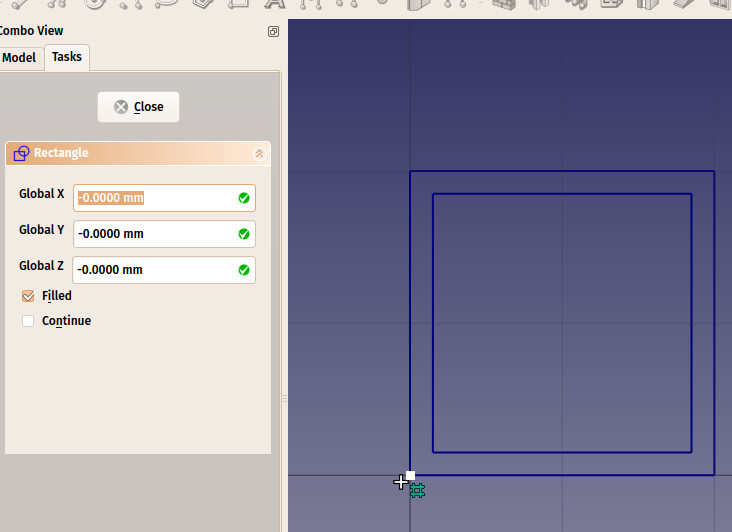

* We will now draw a couple of vertical lines to define where our doors and windows will be placed, using the  [Line](http://www.freecadweb.org/wiki/index.php?title=Draft_Line) tool. The crossing of these lines with our two rectangles will give us useful intersections to snap our final wall shapes to:
    * Press the  [Line](http://www.freecadweb.org/wiki/index.php?title=Draft_Line) button
    * Under the Task tab, make sure the **Relative** check box is unchecked, as we will enter absolute coordinates here. In absolute coordinates, a point at (20,20,0) after a point situated at (10,10,0) will be positioned at (20,20,0). In relative coordinates, it would be added to the previous point and will become (30,30,0). Relative coordinates are useful to indicate do like "go 10cm downwards"
    * Enter the start point coordinates: X:15cm, Y:1m, Z:0
    * Click **Enter Point** or press Enter
    * Enter the end point coordinates X:15cm, Y:3m, Z:0
    * Click **Enter Point** or press Enter to complete the line
* Duplicate that line 5 times, using the  [Move](http://www.freecadweb.org/wiki/index.php?title=Draft_Move) tool with Copy mode turned on. As always, make sure the correct object is selected (highlighted in the model tree), before using the Move tool. Although most FreeCAD tools allow you to either start with a selected object or select an object to work with after you click the tool button, it is always better to verify yourself what you will be working with. Do the following 5 times:
    * Select the first line
    * Turn **Copy** mode on
    * Turn **Relative** mode on, as we will now work with relative coordinates
    * Give a start point, which can be anything, since the displacement will be relative to that point. You can leave it at (0,0,0) for example, or click a same point on the grid. Press Enter or select **Enter Point** if you entered coordinates manually.
    * Give a different endpoint for each of your 5 copies:
         * line001: X:10cm, Y:0, Z:0
         * line002: X:120cm, Y:0, Z:0
         * line003: X:-55cm, Y:-2m, Z:0
         * line004: X:80cm, Y:0, Z:0
         * line005: X:15cm, Y:0, Z:0

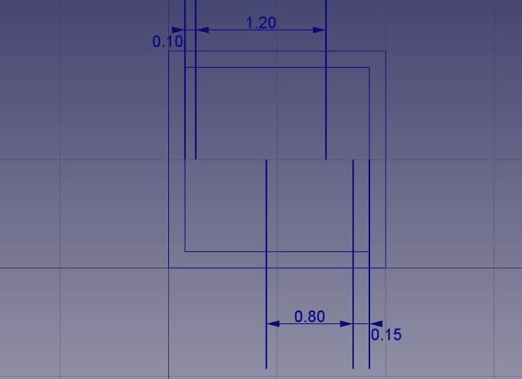

* Optionally, like on the image above, to make sure your lines are placed correctly, you can add a couple of dimensions using the  [Dimension](https://wiki.freecadweb.org/Draft_Dimension) tool. The dimension tool works like the previous tools we used above, by asking you to click several points on screen. The first and second points will give the distance to be measured, and the third point will give the position of the dimension line. To move the dimension text out of the line like on the image above, double-click it in the model view and move the dot under the text by clicking it and giving it a new position.
* That is all we need now, so we can switch off construction mode. Check that all the construction geometry has been placed into a "Construction" group, which makes it easy to hide all at once or even delete completely later.

 * Now would be a good time for an incremental file save, as we did in the previous chapter.

#### Drawing the walls

* Now let's draw our two wall pieces using the  [Polyline](http://www.freecadweb.org/wiki/index.php?title=Draft_Wire) tool. Make sure the  [intersection snap](http://www.freecadweb.org/wiki/index.php?title=Draft_Snap) is turned on, as we will need to snap to the intersections of our lines and rectangles. Draw two bracket-shaped polylines as illustrated below, by clicking all the points of their contours. To close them, either click on the first point again, or press the **Close** button under the coordinate settings in the Tasks panel.

In case you have trouble drawing these shapes correctly, the **Undo** button will allow you to delete the last point if the point fell off the intersection snap.  Zooming in close with the mouse wheel while drawing will also help you to place the points correctly. Make sure the  [intersection snap](http://www.freecadweb.org/wiki/index.php?title=Draft_Snap) icon (or any other adequate snap position) is active before clicking. You might also need to move the mouse a bit around the intersection for its snap position to be detected by FreeCAD.

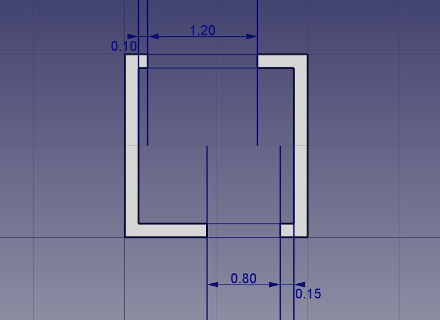

* We can change their default grey color to a nice hatch pattern, by selecting both walls, (highlight both in the model tree) then setting their **Pattern** property, found under the **View** tab, to *Simple*, and their **Pattern size** to your liking, for example 0.01.

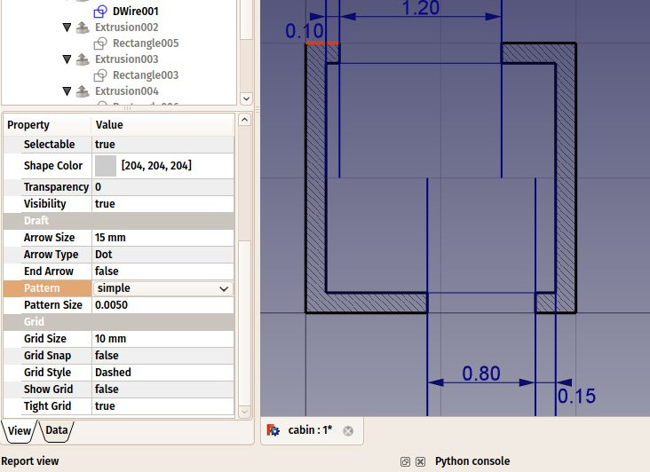

* We can now hide the construction geometry by selecting the Construction group in the model tree, right-clicking it and selecting **Toggle visibility**.

#### Drawing doors and windows

* Deactivate  intersection snap, as it consumes a lot of computer processing, because it needs more complex calculations to detect intersections. This will make drawing faster and more comfortable.
* Make sure the  [midpoint snap](http://www.freecadweb.org/wiki/index.php?title=Draft_Snap) is turned on, and use the  line tool to draw two centered lines as follows:

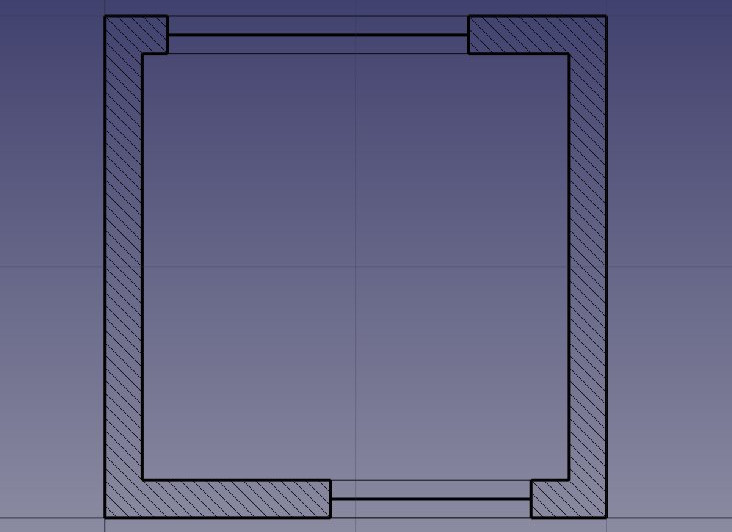

* Optionally, deactivate midpoint snapping. This might help you not snapping to the wrong location in the following steps.
* With the  end point snapping activated, add the 4 inner and outer lines.
* Select one of the inner/outer lines we just added. With the CTRL key pressed, select the three other inner/outer lines, until we have the four selected.
* Under the **View** tab, locate the **Line Color** property and choose a less black color. You can also change the **Line Width** property to make these lines thinner than the others (for example give them a width of 1 if other have a width of 2), to indicate that these lines are seen, while the others are cut.
* We will now modify the door line to create an opened door symbol:
    * In the 3D view select the middle line in the door way. 
    * Start by rotating the line using the  [Rotate](http://www.freecadweb.org/wiki/index.php?title=Draft_Rotate) tool
    * Click the right endpoint of the line as rotation center
    * Make sure copy mode is not active
    * Give it a start angle of **0°**, press Enter
    * Give an end angle of **-90°**. Press Enter.
* Then create the opening arc with the  [Arc](http://www.freecadweb.org/wiki/index.php?title=Draft_Arc) tool. Pick the same point as the rotation center we used in the previous step as center, set the radius by selecting the  other endpoint of the door line, then, with the mouse, indicate the start and end positions of the arc. Pressing SHIFT while moving the mouse will constrain the snapping horizontally or vertically, which might help you to get the correct result:

* With the arc is still highlighted in the model tree,  change the **Draw Style** property, found under the **View** tab, to Dashed, in order to produce a nice dashed arc as above.
* As usual, an incremental save might be in order. Also, do not forget to give more meaningful names to your objects from time to time, as it makes selecting them much easier.

#### Inserting furniture

* We can now start placing some furniture. To begin with, let's place a counter by drawing a rectangle from the upper left inner corner, and giving it a width of 170cm and a height of -60cm. With the rectangle still highlighted in the model tree, under the **View** tab, set the **Transparency ** property to 80%,  to set it apart from the wall geometry. You might also want to give it a thinner line width.

* Then let's add a sink and a cooktop. Drawing these kinds of symbols by hand can be very tedious, and they are usually easy to find on the internet, for example on http://www.cad-blocks.net. In the **Downloads** section below, for your convenience, we drew a sink and a cooktop, and saved them as DXF files.  Download these two files by visiting the links below, and clicking the **download** button.

* Inserting a DXF file into an opened FreeCAD document can be done either by choosing the **File → Import** menu option, or by dragging and dropping the DXF file from your file explorer into the FreeCAD window. The contents of the DXF files might not appear right on the center of your current view, depending on where they were positioned in the DXF file. You can use menu **View → Standard views → Fit all** to zoom out and find the imported objects. 

* Insert the two DXF files, and move them to a suitable location like on the image below, on the counter top, using the move tool. 

It might be difficult to use snapping while the two objects are on the countertop, because of the visible face of the countertop rectangle. You can turn face display off by selecting the countertop object, then setting its **Display Mode** property found under the **View** tab to **Wireframe**. Pressing the **Q** key while drawing will also create temporary snap locations, which might help you to achieve better positioning.

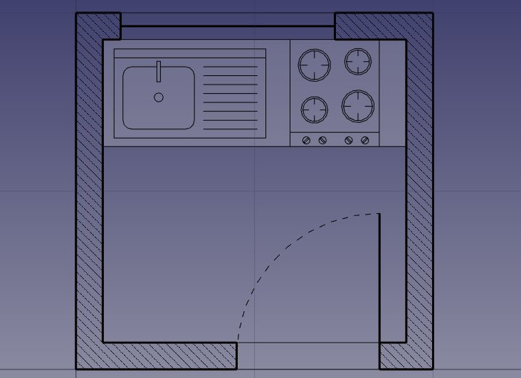

#### Drawing dimensions and annotations

* We can now place a couple of dimensions using the  [Dimension](http://www.freecadweb.org/wiki/index.php?title=Draft_Dimension) tool. Dimensions are drawn by clicking 3 points: a start point and an end point to define a distance to be measured, and a third point to place the dimension line. 
* To make horizontal or vertical dimensions, even if the two measurement points are not aligned, press **SHIFT** while clicking the second point
* In case you didn't set default text size preferences, the dimension text might be too small to read.  To fix this, make sure the dimension is highlighted in the model tree. Under the **View** tab, change the **Font Size** to 10cm and the **Arrow Size** to 2cm.
* If a dimension text is upside down, try inverting its **Flip Text** property. If nothing works, try deleting the dimension and drawing it again from right to left instead of left to right.
* You can change the position of a dimension text by double-clicking the dimension in the model tree. A control point will allow you to move the text graphically. In our exercise, the "0.15" texts have been moved away of the walls for better clarity.
* You can change the contents of the dimension text by editing their **Override** property. In our example, the texts of the door and windows dimensions have been edited to indicate their heights (select the dimension in the Model tree, in the View tab scroll to find the **Override** property):

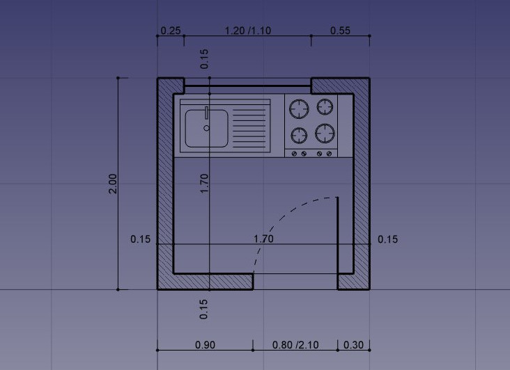

* Let's add some description texts using the  [Text](http://www.freecadweb.org/wiki/index.php?title=Draft_Text) tool. Click a point to position the text, then enter the lines of text, pressing Enter after each line. To finish, press Enter twice.
* The indication lines (also called "leaders") that link the texts to the item they are describing are simply done with the polyline tool. Draw a couple of polylines, starting from the text position, to the place being described. Once that is done, you can add a dot or arrow at the end of the polylines by setting their **End Arrow** property to **True**

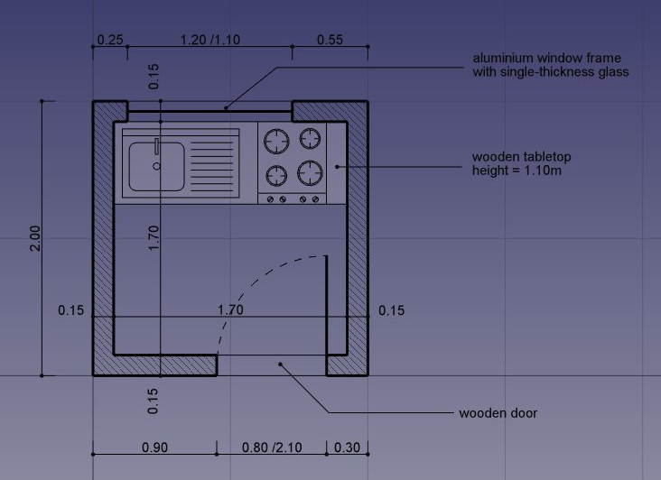

* Our drawing is now complete! As always, this is a good time for an incremental save.

#### Cleaning and exporting

* Since there begins to be quite a number of objects there, it would be wise do some cleaning and place everything in a nice structure of groups, to make the file easier to understand to another person.  Right click on the top entry in the model tree, which shows the file name, and select **Create Group . . .**  At the bottom of the model tree will be a new group.  Right click on the new group and select **Rename**. Let's use Annotations for the new name.  You can now drag and drop items from the model tree into the new Annotations group, such as Text and Text 001, you will see a + come up when you are over the new group:

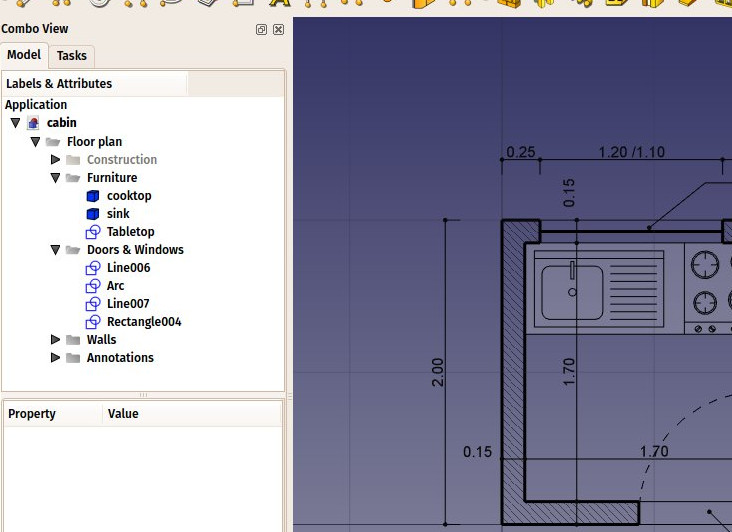

* We can now print our work by placing it on a TechDraw sheet, which will be explained further in this manual, or directly export our drawing to other CAD applications, by exporting it to a DXF file. Simply select our "Floor plan" group, (or highlight the the desired elements in the model tree) and select menu **File → Export**. Select the Autodesk DXF format, give it a file name and click **Save**. The file can then be opened in any other 2D CAD application such as [LibreCAD](http://www.librecad.org). You might notice some minor style differences, depending on the configurations of each application.

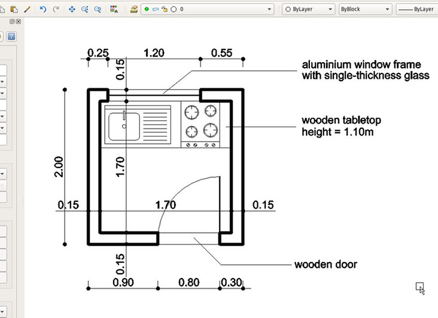

* The most important thing about the Draft Workbench, however, is that the geometry you create with it can be used as a base or easily extruded into 3D objects, simply by using the  [Extrude](http://www.freecadweb.org/wiki/index.php?title=Part_Extrude) tool from the [Part workbench](http://www.freecadweb.org/wiki/index.php?title=Part_Module), or, to stay in Draft, the  [Trimex](http://www.freecadweb.org/wiki/index.php?title=Draft_Trimex) (Trim/Extend/Extrude) tool, which under the hood performs a Part Extrusion,  but does it "the Draft way", that is, allows you to indicate and snap the extrusion length graphically. Experiment extruding our walls as shown below. 
* By pressing the  [working plane](http://www.freecadweb.org/wiki/index.php?title=Draft_SelectPlane) button after selecting a face of an object, you are also able to place the working plane anywhere, and therefore draw Draft objects in different planes, for example on top of the walls. These can then be extruded to form other 3D solids. Experiment setting the working plane on one of the top faces of the walls, then draw some rectangles up there. 

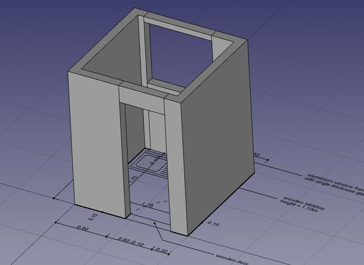

* All kinds of openings can also be done as easily by drawing Draft objects on the faces of walls, then extruding them, then using the boolean tools from the Part Workbench to subtract them from another solid, as we saw in the previous chapter.

Fundamentally, what the Draft Workbench does is provide graphical ways to create basic Part operations. While in Part you will usually position objects by setting their placement property by hand, in Draft you can do it on-screen. There are times when one is better, other times when the other is preferable. Don't forget, you can create [custom toolbars](http://www.freecadweb.org/wiki/index.php?title=Interface_Customization) in one of these workbenches, add the tools from the other, and get the best of both worlds.

Do not forget that there are always many ways to do things in FreeCAD. Our walls above, for example, could have been drawn without the construction geometry, simply by drawing two C-shaped polylines, creating offsets, connecting lines, then binding everything with the upgrade tool.

-----

**Downloads**

* The file created during this exercise: https://github.com/yorikvanhavre/FreeCAD-manual/blob/master/files/cabin.FCStd
* The sink DXF file: https://github.com/yorikvanhavre/FreeCAD-manual/blob/master/files/sink.dxf
* The cooktop DXF file: https://github.com/yorikvanhavre/FreeCAD-manual/blob/master/files/cooktop.dxf
* The final DXF file produced during this exercise: https://github.com/yorikvanhavre/FreeCAD-manual/blob/master/files/cabin.dxf

**Read more**

* The Draft workbench: http://wiki.freecadweb.org/Draft_Module
* Snapping: http://wiki.freecadweb.org/Draft_Snap
* The working plane: http://wiki.freecadweb.org/Draft_SelectPlane
* Layers: https://wiki.freecadweb.org/Draft_Layer
