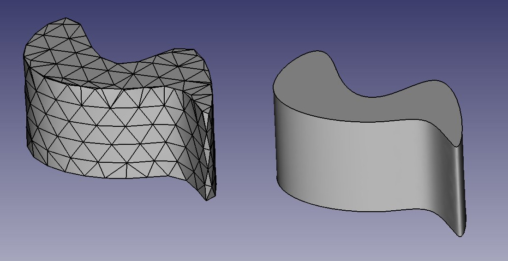
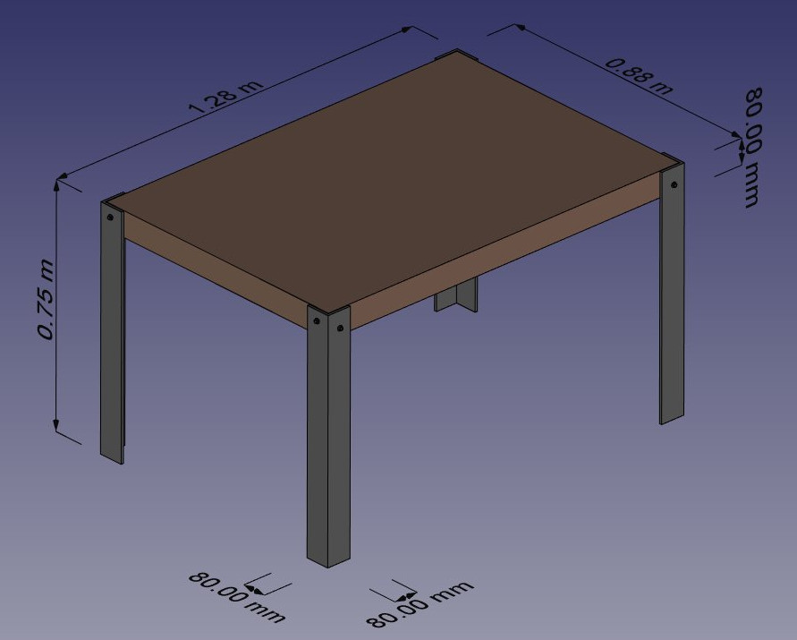
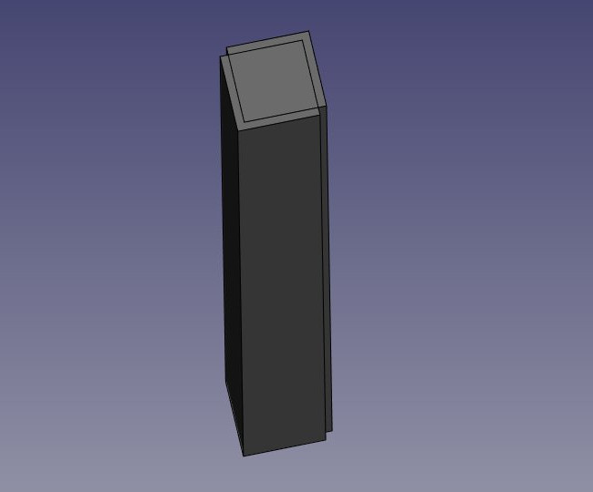
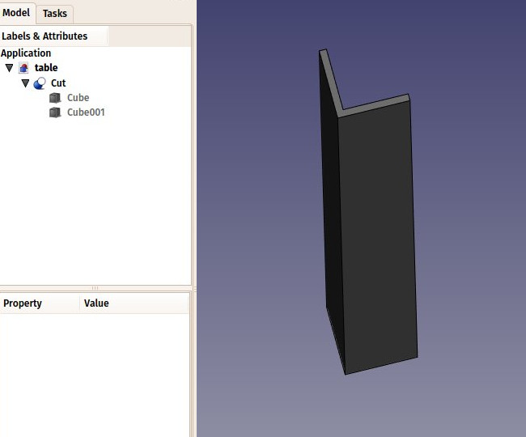
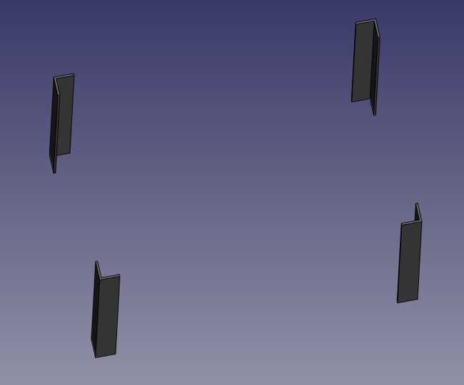
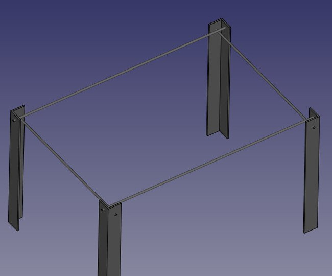
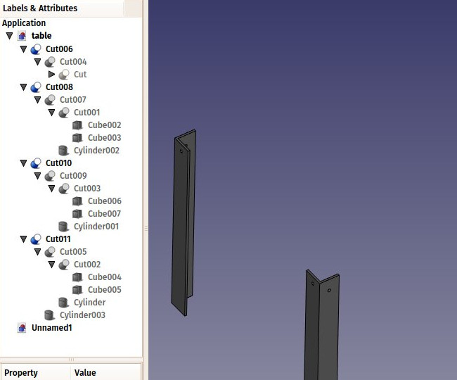
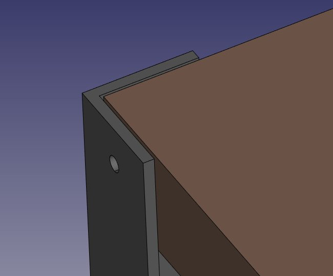
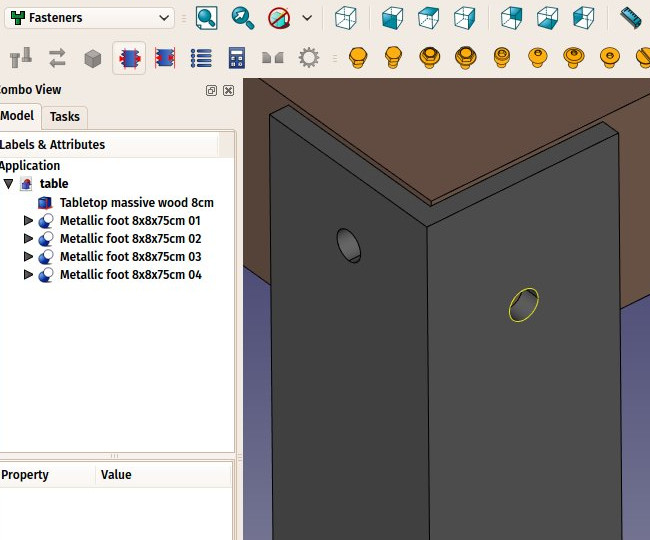
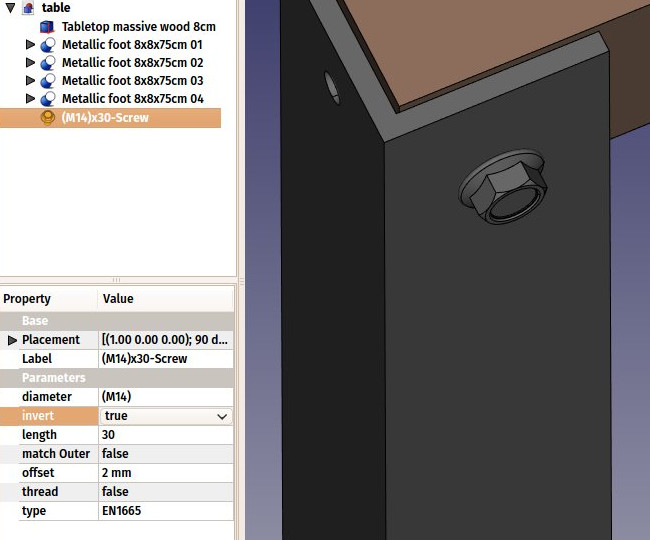

## Traditional modeling - the CSG way

CSG stands for [Constructive Solid Geometry](https://en.wikipedia.org/wiki/Constructive_solid_geometry) and describes the most basic way to work with solid 3D geometry, which is creating complex objects by adding and removing pieces to/from solids by using Boolean operations such as union, subtraction or intersection.

As we saw earlier in this manual, FreeCAD handles many types of geometry, but the preferred and most useful type, which is solid geometry, also called [BREP](https://en.wikipedia.org/wiki/Boundary_representation) geometry, is mainly handled by the [Part Workbench](http://www.freecadweb.org/wiki/index.php?title=Part_Module). Unlike [polygon meshes](https://en.wikipedia.org/wiki/Polygon_mesh), which are made only of points and triangles, BREP objects have their faces defined by mathematical curves, which permit absolute precision, no matter the scale.

The difference between the two can be compared to the difference between bitmap and vector images. As with bitmap images, polygon meshes have their curved surfaces subdivided in a series of facets. If you zoom in very closely, or print it very large, you will see, not a curved but a faceted surface. In both vector images and BREP data, the position of any point on a curve is not stored in the geometry but calculated on the fly, with exact precision.

In FreeCAD, all BREP-based geometry is handled by another piece of open-source software, [OpenCasCade](https://en.wikipedia.org/wiki/Open_Cascade_Technology). The main interface between FreeCAD and the OpenCasCade kernel is the Part Workbench. Most other workbenches build their functionality on top of the Part Workbench.

Although other workbenches often offer more advanced tools to build and manipulate geometry, they all actually manipulate Part objects.  It is very useful to know how these objects work internally, and to use the Part tools since, being simpler, they can very often help you to work around problems that the more intelligent tools fail to solve properly.

To illustrate the working of the Part Workbench, we will model this table, using only CSG operations (except the screws, for which we will use one of the add-ons, and the dimensions, which we will see in the next chapter):

In this exercise, we will assume some default settings. Feel free to adjust to your liking if you feel so:

- We will work in metric units. Set units system to "metric/MKS" under menu *Edit → Preferences → Units*
- We will use the default (CAD) navigation style. To change the navigation style, right click anywhere on the 3D view and choose another one

#### Modeling the metallic feet

* Let's open FreeCAD and create a new document, if not already done (**Ctrl+N** or menu *File → New*)
* Switch to the Part Workbench
* We will begin with the first foot. Press the  **Cube** button (or menu *Part → Primitives → Cube* )
* Select the cube, (click on the cube in the model tree or the 3D view) then set the following properties in the **Data** tab:
   * Length: 80mm (or 8cm, or 0.8m, FreeCAD works in any unit)
   * Width: 80mm
   * Height: 75cm
* If needed, adjust geometry view with the  **Fit** button (or menu *View → Default views → Fit all*)
* Adjust the view with the  **Axonometric view** button (or menu *View → Default views → Axonometric*)
* Duplicate the cube (make sure it is still highlighted in Model tab) by pressing **Ctrl+C** then **Ctrl+V** (or menu *Edit → Copy* and *Edit → Paste*). No change will be evident in the 3D view, as the second object is identical and placed exactly on the first one
* Select the new object that has been created (Click on Cube001 in the model tree)
* Change its position by editing its **Placement** property, found in the **Data** tab. The [placement](https://wiki.freecadweb.org/Placement) is a FreeCAD structure that combines position and rotation. All geometric objects have one. By expanding the placement entry in the properties list, you will be able to access both the rotation (which consists of an axis direction and an angle), and the position (made of x, y and z coordinates). The position indicated by the placement is not necessarily tied to the center of the object, it is just an abstract reference point. But by changing it, we move the whole object geometry. Let's move our second cube 8mm in both x and y directions by setting the following values:
    * Position X: 8mm (In the Translation Fields)
   * Position Y: 8mm  (Select OK when complete)

We will now obtain two overlapping high boxes, one 8mm apart from the other:

* Now we will subtract one from the other, in order to create an L-shaped foot: Select the **first** one, that is, the one that will **stay** (labeled Cube) , then, with the CTRL key pressed, select the **other** one, that will be **subtracted** (labeled Cube001). The order in which you select both pieces is important for FreeCAD to know which one to subtract. Now press the  **Cut** button (or menu *Part → Boolean → Cut*):

Observe that by expanding the newly created object called "Cut" in the model tree, it still contains the two cubes we used as operands.  In fact, the two cubes are still there in the document, they have merely been hidden and grouped under the Cut object.  You can still see and select them from the model tree, and, if you wish, turn them visible again by right-clicking them and select *Toggle Visibility*.  You can also still  change any of their properties or use them as operands in other subsequent operations.

* Now might be a good time to save our work in a new file, using menu *File →Save As*

* Now let's create the three other feet by duplicating our base cube 6 other times. Since it is still in the clipboard, you can simply hit **Ctrl+V** 6 times. They will all be overlaying each other and we can edit them separately by selecting one after the other in the model tree.  Change their position (under **Placement**) as follows:
   * cube002: Position X: 0, Position Y: 80cm
   * cube003: Position X: 8mm, Position Y: 79.2cm
   * cube004: Position X: 120cm, Position Y: 0
   * cube005: Position X: 119.2cm, Position Y: 8mm
   * cube006: Position X: 120cm, Position Y: 80cm
   * cube007: Position X: 119.2cm, Position Y: 79.2cm
   
   Be sure to use the view controls to zoom and resize what you see in the 3D view, to check that things are going the way we want.

* Now let's do the three other cuts, selecting first the "host" cube then the cube to be cut off. We now have four Cut objects:

* Save your work to this point, by hitting **Ctrl+S** or menu *File → Save*. Remember to save often, so if you happen to do something wrong, it will be easy to revert to the last time you saved your file, using menu *File → Revert*.

You might now be thinking that, instead of duplicating the base cube six times, we could have duplicated the complete foot three times. This is totally true, as always in FreeCAD, there are many ways to achieve a same result. This is a precious thing to remember, because, as we will advance into more complex objects, one particular modeling method might not work out the way we want, and we almost always have the possibility to try other methods.

* We will now make holes for the screws, using the same Cut method. Since we need 8 holes, two in each foot, we could make 8 objects to be subtracted. Instead, let's explore other ways and make 4 tubes, that will be reused by two of the feet. So let's create four tubes by using the Cylinder tool.  Click the   **Cylinder** button once to create a first cylinder.
* You might not see the new cylinder as its default properties will make it very small. Select the cylinder in the model tree, and give it a radius of 6mm and a length of 130cm. Both properties are found under the **Data** tab.
* This time, we will need to rotate the cylinder, which is also done via the **Placement** property. In the Data tab, expand the placement, and locate its Angle and Axis properties, which control the rotation. Set them as follow:
    * Angle: 90 degrees  
    * Axis: X: 0, Y: 1, Z: 0. This will rotate our cylinder by 90° around the Y (green) axis
    * Position: X:-10mm, Y: 40mm, Z: 72cm

* Select the cylinder and copy/paste it with **Ctrl+C** and **Ctrl+V**, resulting in two cylinders, once again overlaying each other.

* Select the new cylinder (Cylinder001 in the model tree), and locate  its Placement property.  Change the Position values: X: -10 mm; Y: 84 cm; Z: 72 cm.

* Select our Cylinder001 and copy/paste it to create a third cylinder.  Select the third one, named Cylinder002.  Change both its rotation and position:
    * Angle 90 degrees 
    * Axis: X:-1, Y:0, Z:0
    * Position: X: 40mm; Y: -10mm; Z: 70 cm

* Also change the height of our third cylinder to from 130cm to 90cm.

* Copy/paste Cylinder002 to obtain our fourth stick, and change the new cylinder's placement values:

    * Position: X: 124cm; Y: -10mm; Z: 70cm

We should now have obtain four rods crossing the L-shaped feet.

If anything in your model doesn't look like the image above, review the cylinders placements:

  * **cylinder**: height: 130cm, angle: 90°, axis: (0,1,0), position: X:-10mm, Y:40mm, Z:72cm
  * **cylinder001**: height: 130cm, angle: 90°, axis: (0,1,0), position: X:-10mm, Y:84cm, Z:72cm
  * **cylinder002**: height: 90cm, angle: 90°, axis: (-1,0,0), position: X:40mm, Y:-10mm, Z:70cm
  * **cylinder003**: height: 90cm, angle: 90°, axis: (-1,0,0), position: X:124cm, Y:-10mm, Z:70cm

You will notice that the cylinders are a bit longer than needed. This is because, as in all solid-based 3D applications, boolean operations in FreeCAD are sometimes oversensitive to face-on-face situations and might fail. By doing this, we put ourselves on the safe side. It is a good habit to take to always make sure objects to subtract or unite are always a little bit longer or shorter, in order to avoid coinciding faces.

* Now let's do the subtractions. Select the first foot, then, with CTRL pressed, select one of the tubes that crosses it, then press the **Cut** button. The hole will be done, and the tube hidden. Find it in the tree view by expanding the pierced foot, it will be needed for the foot at the other end of the tube.  By right -clicking the cylinder in the model tree and selecting *Toggle Visibility*, you can make it visible again, which might make selecting the right rod easier.
* Select another foot pierced by this hidden tube, then repeat the operation, this time pressing the Ctrl key while selecting the tube in the tree view.  Repeat this for the other feet until each of them has its two holes:

Do not forget to save your file often.  A benefit of incremental saving is that if the next step becomes too spoiled, you can abandon it with an *Exit without Saving* and restart from a known valid point.

As you can see, each foot has become a quite long series of operations. All this stays parametric, and you can go change any parameter of any of the older operations anytime. For example if you decide the table should be workbench height, you can go back and change the cube heights to 90cm. In FreeCAD, we often refer to this pile as "modeling history", since it in fact carries all the history of the operations you did. 

In FreeCAD and other feature-based modelers, the concepts of 3D object and 3D operation tend to blend into the same thing. The "Cut" we did above is at the same time an operation, and the 3D object resulting from this operation. In FreeCAD you will therefore often see these called "features" rather than "objects" or "operations".

#### Modeling the tabletop

* Now let's model the tabletop. It will be a simple block of wood, let's do it with another **Cube** with length: 126cm, width: 86cm, height: 8cm. Again, it will initially not be visible, as it will come in small, overlaying the bottom of the first foot.  Select the new cube in the model tree and in the **Data** tab enter the final dimensions. Set also its position to X: 10mm, Y: 10mm, Z: 67cm.   In the **View** tab, you can give it a nice brownish, wood-like color by changing its **Shape Color** property. As always, before modifying any property, make sure that the correct cube is selected in the model tree.

* Another file save at this point would be good.

Notice that, although the legs are 8mm thick, we placed our table top 10mm away, leaving 2mm between them. This is not necessary, of course, it won't happen with the real table, but it is a common thing to do in that kind of "assembled" models, it helps people who look at the model to understand that these are independent parts, that will need to be attached together manually later. And this 2mm spacing is so small that it would not affect the cutting dimensions of the different pieces. It can be considered a "tolerance value".

* Now that our five pieces (4 metallic feet and a wooden table top) are complete, it is a good time to give them more proper names than "Cut015". By right-clicking the objects in the tree view (or pressing **F2**), you can rename them to something more meaningful to yourself or to another person who would open your file later. It is often said that simply giving descriptive names to your objects is much more important than the way you model them.

#### Placing the screws

* We will now place some screws. There is an extremely useful addon developed by a member of the FreeCAD community, that you can install from the [addons manager](https://wiki.freecadweb.org/Std_AddonMgr), called [Fasteners](https://github.com/shaise/FreeCAD_FastenersWB), that makes the insertion of screws very easy. The addons manager is located under menu *Tools*.
* Once you have installed the Fasteners Workbench and restarted FreeCAD, it will appear in the workbenches list, and we can switch to it. Adding a screw to one of our holes is done by first selecting the circular edge of our hole, in the 3D view:

* Then we can press one of the screw icons of the Fasteners Workbench, for example the *EN 1665 Hexagon bolt with flanges, heavy series* (By moving the mouse to a screw icon and hovering, the name will be revealed, or simply choose one of the entries from the *Fasteners* menu).  By clicking the screw button, it will be placed and aligned with our hole, and the diameter will automatically be selected to match the size of our hole. Select each outside hole circle and press the same screw button for each hole.

* Sometimes the screw tool will guess wrong, and the screw will be placed inverted. We can correct this by flipping its **invert** property. Select the inverted screw, locate its **invert** property under the **Data** tab, and set its value to *true*. Hit **Ctrl+R** to recompute the document.

* We can also set its **offset** property to 2mm, to follow the same rule we used between the tabletop and the feet:

* Repeat this for all the holes, save the file and our table is complete!

By now frequent incremental file saves should have become a second nature, it is highly recommended to keep this good habit in next chapters of this book.

#### The internal structure of Part objects

As we saw above, it is possible in FreeCAD to select not only whole objects, but parts of them, such as the circular border of our screw hole. This is a good time to have a quick look at how Part objects are constructed internally. Every workbench that produces Part geometry will be based on these:

* **Vertices**: These are points (usually endpoints) on which all the rest is built. For example, a line has two vertices.
* **Edges**: the edges are linear geometry like lines, arcs, ellipses or [NURBS](https://en.wikipedia.org/wiki/Non-uniform_rational_B-spline) curves. They usually have two vertices, but some special cases have only one (a closed circle for example).
* **Wires**: A wire is a sequence of edges connected by their endpoints. It can contain edges of any type, and it can be closed or not. In other applications, it is sometimes called "polyline".
* **Faces**: Faces can be planar or curved, and is formed by at least one, outer closed wire, which forms the border of the face, and optionally more inner wires, in case the face has holes.
* **Shells**: Shells are simply a group of faces connected by one or more of their edges. It can be open or closed.
* **Solids**: When a shell is tightly closed, that is, it does not "leak", it can become a solid. Solids carry the notion of inside and outside. Many workbenches rely on solids to make sure the objects they produce can be built in the real world.
* **Compounds**: Compounds are simply aggregates of other shapes, no matter their type, into a single shape.

In the 3D view, you can select individual **vertices**, **edges** or **faces**. Selecting one of these also selects the whole object.

#### A note about shared design

You might look at the table above, and think its design is not good. The attachment of the feet to the tabletop is probably too weak. You might want to add reinforcing pieces, or you have other ideas to make it better. This is where sharing becomes interesting. You can download the file made during this exercise from the link below, and modify it to make it better. Then, if you share that improved file, others might be able to make it even better, or use your well-designed table in their projects. Your design might then give other ideas to other people, and maybe you will have helped a tiny bit to make a better world...

FreeCAD files carry a **license** field, located, among other useful information, under *File → File Properties*. You can specify here a sharing-friendly license such as [Creative Commons](https://creativecommons.org/), which legally allows other people to reuse your file, while preserving some of your rights, such as being identified as the author of the file.

-----

**Downloads**

* The file produced in this exercise: https://github.com/yorikvanhavre/FreeCAD-manual/blob/master/files/table.FCStd

**Read more**

* The Part workbench: http://wiki.freecadweb.org/Part_Module
* Placements: https://wiki.freecadweb.org/Placement
* The addons aanager: https://wiki.freecadweb.org/Std_AddonMgr
* The Fasteners workbench: https://github.com/shaise/FreeCAD_FastenersWB
* Creative Commons: https://creativecommons.org/
